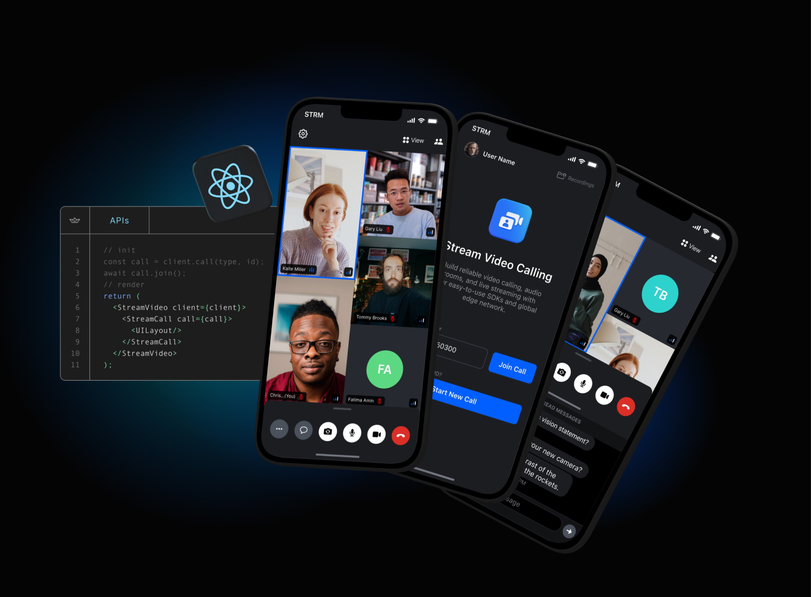

# Official React SDK for [Stream Video](https://getstream.io/video/docs/)

## **Quick Links**

- [Register](https://getstream.io/chat/trial/) to get an API key for Stream Video
- [React Video Tutorial](https://getstream.io/video/docs/react/tutorials/video-calling/)
- [Sample application](https://getstream.io/video/demos/)

## What is Stream?

Stream allows developers to rapidly deploy scalable feeds, chat messaging and video with an industry leading 99.999% uptime SLA guarantee.

With Stream's video components, you can use their SDK to build in-app video calling, audio rooms, audio calls, or live streaming. The best place to get started is with their tutorials:

- Video & Audio Calling Tutorial
- Audio Rooms Tutorial
- Livestreaming Tutorial

Stream provides UI components and state handling that make it easy to build video calling for your app. All calls run on Stream's network of edge servers around the world, ensuring optimal latency and reliability.

## 👩‍💻 Free for Makers 👨‍💻

Stream is free for most side and hobby projects. To qualify, your project/company needs to have < 5 team members and < $10k in monthly revenue. Makers get $100 in monthly credit for video for free.

## 💡Supported Features💡

Here are some of the features we support:

- Developer experience: Great SDKs, docs, tutorials and support so you can build quickly
- Edge network: Servers around the world ensure optimal latency and reliability
- Chat: Stored chat, reactions, threads, typing indicators, URL previews etc
- Security & Privacy: Based in USA and EU, Soc2 certified, GDPR compliant
- Dynascale: Automatically switch resolutions, fps, bitrate, codecs and paginate video on large calls
- Screen sharing
- Picture in picture support
- Active speaker
- Custom events
- Geofencing
- Notifications and ringing calls
- Opus DTX & Red for reliable audio
- Webhooks & SQS
- Backstage mode
- Flexible permissions system
- Joining calls by ID, link or invite
- Enabling and disabling audio and video when in calls
- Flipping, Enabling and disabling camera in calls
- Enabling and disabling speakerphone in calls
- Push notification providers support
- Call recording
- Broadcasting to HLS

## Roadmap

### 0.4 milestone

- [x] Enhanced device management API
- [x] Composite layout for streaming and recording
- [x] Livestream Player
- [ ] Screenshare Audio
- [ ] Screen-sharing resolution and FPS control
- [ ] Fast-reconnects
- [ ] New Device Management API
- [x] SFU retries
- [x] Call Thumbnails
- [ ] Query call session endpoint

### 0.5 milestone

- [ ] Enhanced UI components and theming
- [ ] Enhanced SDK build system
- [ ] Typescript generics enhancements
- [ ] Hardware-accelerated video encoding on supported platforms
- [ ] Performance and bundle-size optimizations
- [ ] Dynascale 2.0 (codecs, f resolution switches, resolution webrtc handling)
- [ ] Call analytics / stats
- [ ] Logging 2.0
- [ ] E2E testing platform

### 0.6 milestone

- [ ] Break-out rooms
- [ ] Waiting rooms
- [ ] Transcriptions
- [ ] Closed captions
- [ ] Video and audio filters
- [ ] Dynascale: turn off incoming video when the browser is in the background

## Contributing

- How can I submit a sample app?
  - Apps submissions are always welcome. 🥳 Open a PR with a proper description and we'll review it as soon as possible.
- Spot a bug 🕷 ?
  - We welcome code changes that improve the apps or fix a problem. Please make sure to follow all best practices and add tests if applicable before submitting a Pull Request on Github.
