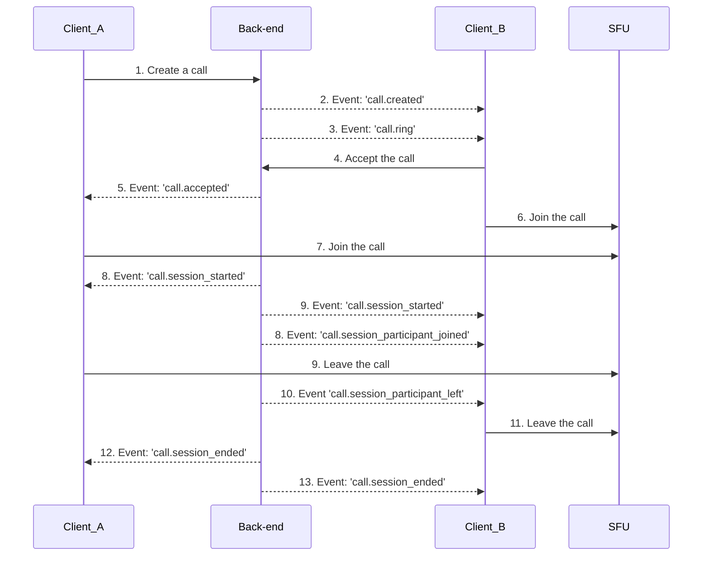
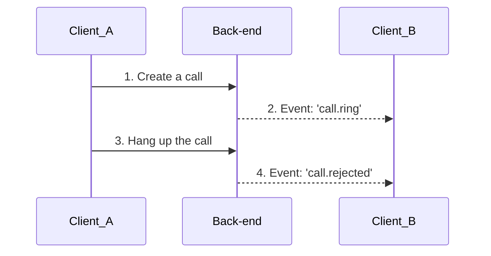

import CallAcceptedDiagram from '../assets/02-guides_02-call-lifecycle/ring-call-sequence-diagram_call-accepted.png';
import CallRejectedDiagram from '../assets/02-guides_02-call-lifecycle/ring-call-sequence-diagram_call-rejected.png';
import CallEndedDiagram from '../assets/02-guides_02-call-lifecycle/ring-call-sequence-diagram_call-ended.png';

## Introduction

In the following sections, we will describe the flow of the two basic call scenarios:

1. Call room (meeting call)
2. Ring call

### Agents and Services

Before we start to describe the individual call scenarios, we should get acquainted with the agents participating in the call flow.

A user, that connects to a call is using a client (application) that communicates with Stream's back-end services.
The call creation and orchestration to connect to a call is handled by a service we call simply `back-end`.

Once it is clarified with the `back-end` service, who intends to join a specific type of call, the client connects to a service we call [`SFU` (Selective Forwarding Unit)](https://getstream.io/blog/what-is-a-selective-forwarding-unit-in-webrtc/)

The `back-end` tells the client, to which `SFU` it should connect. The `SFU` server is where the call actually takes place. All the data exchanged during the call (audio, video, etc.) flows through the assigned `SFU`.

Another important aspect of the call lifecycle are **Call Sessions** you can read more about in the [Call Session](#call-session) section.

## Call Session

A _Call Session_ represents a specific time period in which participants are actively engaged in a call.
The concept of a call session is particularly useful when dealing with recurring calls
(or ring calls that typically have a single call session unless they are reused).

1. **Meeting Calls (call room):** In the case of meeting calls, where participants engage in multiple instances of the same call, each instance has its own call session. This allows for tracking and organizing the individual sessions.

2. **Ring Calls:** Ring calls, which are initiated to establish a direct connection between participants, typically have a single call session. However, if the same ring call is reused for subsequent connections, each reuse can be considered a separate call session.

A call session begins whenever a participant joins a call instance. This can occur when a participant initially joins the call.
The start of a call session marks the beginning of the active communication period.

A call session ends whenever the last participant leaves the call. It signifies the conclusion of the active communication period.
The termination of a call session implies that participants are no longer actively engaged in the call context.

To keep subscribed clients informed about the state of call sessions, these events are available:

1. `call.session_started`: This event is emitted when a call session begins.
2. `call.session_ended`: This event is emitted when a call session ends.
3. `call.session_participant_joined`: This event is emitted when a participant joins a call session.
4. `call.session_participant_left`: This event is emitted when a participant leaves a call session.

These events allow subscribed clients to track and manage the lifecycle of call sessions
and perform necessary actions based on the start and end of sessions.

## Call room

The call room scenario refers to a setup, where participants can join a call asynchronously. That means that the call can be (re)joined or left at any time by any number of participants. However, once the call is **ended**, the call cannot be re-joined. This scenario is useful if you want to create calls that work similarly to Google Meet or Zoom calls.

:::note
You can end a call by calling [`endCall()` method](../04-call-engine/Call.md#endcall) of the `Call` class.
:::

### Call room lifecycle

The asynchronous nature of the call room makes it easy to create and join a call. There is no need to wait for other participants. The member initiating the call can create and join it in one single step by calling [`join()` method](../04-call-engine/Call.md#join) of a `Call` instance:

```ts
const call = videoClient.call(callType, callId);
await call.join({ create: true });
```

This takes care of the whole negotiation process and connection to the nearest SFU.

To leave the call without interrupting it, simply call [`leave()` method](../04-call-engine/Call.md#leave) of the `Call` class.

Call can be ended immediately and also prevented from being re-joined permanently by calling the [`endCall()` method](../04-call-engine/Call.md#endcall) of the `Call` class.

### Backstage mode

Backstage mode can be used to decide who can join a call. When backstage mode is on, only users with [`join-backstage` capability](../../guides/permissions-and-moderation/#capabilities-1) can join the call. This is typically used for live streams where the hosts gather before the streaming is started.

Here is how you can toggle the backstage mode:

```typescript
let call: Call;

// Turn off backstage mode, anyone can join
call.goLive();

// Turn on backstage mode, only specific users can join
call.stopLive();
```

You can use the [`useCallIsLive()`](../../call-engine/hooks-and-contexts/#useiscalllive) hook to know if the call is live or not.

Backstage mode is only available for calls with [call types](../../guides/10-configuring-call-types) that have `backstage_enabled: true`.

### Application State

We recommend you to keep the `Call` instance in your app's local state to have access to its API.

## Ring call

The ring call scenario is analogous to the classic phone call. A person calls another person and does not join the call, until the call is accepted on the other side. For this scenario it is typical to show outgoing and incoming call screens and possibly play ring sounds or display ringing elements in the UI. Of course, the call can be terminated before it is accepted. The original caller can decide to **cancel** the outgoing call or the receiving side can **reject** the incoming call.

If the incoming call is accepted, both parties join the call and start exchanging media streams (audio and video). The call is then terminated by one of the participants and both leave the call. The ring call is synchronous in the meaning that all the participants have to be available to join the call during the time between it was initiated and left by the last participant. Once it is ended, it cannot be rejoined.

### Signalling

The communication between the clients follow these principles in the ring scenario:

1. A client sends HTTP requests to the service (initiate a call, accept a call, ...)
2. Service propagates the information in the form of a WS event to other clients

### Ring call lifecycle

We have to explicitly opt in to ring mode when creating (starting) a call:

```ts
let videoClient: StreamVideoClient = ...;

videoClient.call(callType, callId).getOrCreate({
    // highlight-next-line
  ring: true,
  data: { ... }
});
```

With the `ring` parameter set to `true` the **signalling between the services and clients** is enabled. That means the HTTP requests are sent to Stream services and Stream services broadcast the WS events / notifications to call members.

:::note
We distinguish between call members and call participants. Members are considered those, that are invited to a call, but may reject to join. Participants are members, who have joined a call.
:::

Once the call is created by Client A, there are three possible paths:

#### **1. Client B accepts the call**

This is the happy path, when both parties join the active call. The




#### **2. Client B rejects the call**

This scenario takes place, when the **Client B** sends the rejection request to the `back-end` service. The service then communicates this information to the **Client A** through a WebSocket event `call.rejected`. Note that `SFU` is not assigned and thus not taking part in this process.

```mermaid
sequenceDiagram
sequenceDiagram
    participant Client_A
    participant Back-end
    participant Client_B
    Client_A->>Back-end: 1. Create a call
    Back-end-->>Client_B: 2. Event: 'call.ring'
    Client_B->>Back-end: 3. Reject the call
    Back-end-->>Client_A: 4. Event: 'call.rejected'

```


#### **3. Client A cancels the call**

This scenario takes place, when the **Client A** hangs up before the user using **Client B** reacts to the incoming call notification. The service then communicates this information to the **Client B** through a WebSocket event `call.ended`. Note that `SFU` is not assigned and thus not taking part in this process.




### Automatic call cancellation

At times, the called in user may not respond to the incoming call by accepting or rejecting it. In that case the call is automatically rejected by the client based on the configuration parameter `settings.ring.incoming_call_timeout_ms`. The configuration parameter is provided with the `CallRingEvent.call` object delivered with `call.ring` event.
Symmetrically the configuration parameter `settings.ring.auto_cancel_timeout_ms` is provided to the client initiating the call when the call is created (`GetOrCreateCallResponse.call`). The default timeout is 15 seconds for both parameters.

### Application State

We allow the applications to observe the list of currently pending incoming, outgoing or meeting calls.
The application can subscribe to the `calls` array in the `StreamVideoClient.readonlyStateStore` or utilize the [`useCalls`](../../call-engine/hooks-and-contexts/#usecalls) hook

## Call calling state

In an individual call lifespan various situations can occur that are then reflected in something we named **calling state**. Thus, a call can be in state of joining, reconnection, left etc.
This is reflected within the [`Call` objects internal state](../../call-engine/Call#state).

## Reconnections

## Hybrid scenarios

TODO: do we want to describe those? For example Slack call is a hybrid of the 2 above.
