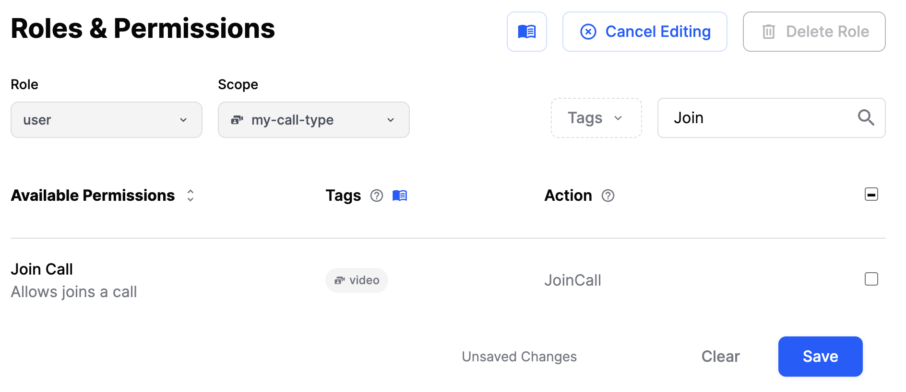
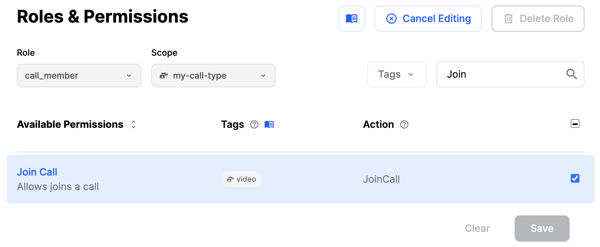

This guide shows how to create, join, leave, and end calls and ring calls.

## Call

### Create call

You create a call by specifying a call type and a call id.
The [call type](../../guides/configuring-call-types) controls which features are enabled, and sets up permissions.

```typescript
const callType = 'default';
const callId = 'test-call';

const call = client.call(callType, callId);
await call.getOrCreate();

// or create it with options:
await call.getOrCreate({
  data: {
    /* call creation options */
  },
});
```

See all possible options at the [Call creation options section](#call-creation-options).

### Join call

```typescript
const callType = 'default';
const callId = 'test-call';

const call = client.call(callType, callId);
await call.join();
```

### Create and join a call

For convenience, you can create and join a call in a single operation. One of the flags you can provide there is `create`.
Set this to `true` if you want to enable creating new call. Set it to `false` if you only want to join an existing call.

See all possible options at the [Call creation options section](#call-creation-options).

```typescript
await call.join({
  create: true,
  data: {
    /* call creation options */
  },
});
```

### Join with mic and camera on or off

You can override the default mic and camera settings before you join a call.
Typically, you should configure this in your Lobby view:

```typescript
const call = client.call('default', 'test-call');

// enable mic and camera
await call.camera.enable();
await call.microphone.enable();

// alternatively, you can disable them
await call.camera.disable();
await call.microphone.disable();

// and then join the call
await call.join();
```

### Leave call

To leave a call, you can use the `leave` method:

```typescript
await call.leave();
```

### End call

Ending a call requires a [special permission](../../guides/permissions-and-moderation). This action terminates the call for everyone.

```typescript
await call.endCall();
```

Only users with special permission can join an ended call.

### Load call

Existing calls can be loaded through the following API:

```typescript
const call = client.call(type, id);
await call.get(); // just load

await call.getOrCreate(); // create if not present and load it
```

These operations initialize the `call.state` and create a subscription for call updates to our backend.
This means that this `call` instance will receive real-time updates in case it is modified somewhere else.

Read more about call state here: [Call & Participant State](../../guides/call-and-participant-state/).

### Update call

After creating a call, you can update some of its properties:

```typescript
import { RecordSettingsRequestModeEnum } from '@stream-io/video-react-sdk';

await call.update({
  custom: { color: 'green' },
  settings_override: {
    recording: {
      mode: RecordSettingsRequestModeEnum.DISABLED,
    },
  },
});
```

## Ring call

### Create call

To create a ring call, we need to set the `ring` flag to `true` and provide the list of members we want to call.
It is important to note that the caller should also be included in the list of members.

```typescript
await client.call('default', 'test-outgoing-call').getOrCreate({
  // highlight-next-line
  ring: true,
  data: {
    members: [
      // highlight-next-line
      { user_id: 'myself' },
      { user_id: 'my friend' },
    ],
  },
});
```

See all possible options at the [Call creation options section](#call-creation-options)

This step will start the signaling flow.
The caller will automatically join the call once the first callee accepts the call.
The call will automatically stop if every callee rejects the call.

### Watch for incoming and outgoing calls

The easiest way to watch for incoming and outgoing calls is to use the `useCalls` hook.

```tsx
import { useCalls, CallingState } from '@stream-io/video-react-sdk';

export const MyCallUI = () => {
  const calls = useCalls();

  // handle incoming ring calls
  const incomingCalls = calls.filter(
    (call) =>
      call.isCreatedByMe === false &&
      call.state.callingState === CallingState.RINGING,
  );

  const [incomingCall] = incomingCalls;
  if (incomingCall) {
    // render the incoming call UI
    return <MyIncomingCallUI call={incomingCall} />;
  }

  // handle outgoing ring calls
  const outgoingCalls = calls.filter(
    (call) =>
      call.isCreatedByMe === true &&
      call.state.callingState === CallingState.RINGING,
  );

  const [outgoingCall] = outgoingCalls;
  if (outgoingCall) {
    // render the outgoing call UI
    return <MyOutgoingCallUI call={outgoingCall} />;
  }

  return null;
};
```

You can also check the sample integration in the following CodeSandboxes:

- [Caller side](https://codesandbox.io/s/stream-video-ringing-caller-x3twcw)
- [Callee side](https://codesandbox.io/s/stream-video-ringing-callee-28wssp)

### Canceling a call

A caller can cancel an outgoing call until the first callee accepts the call. Canceling a call will stop the signaling flow.

```typescript
await call.leave();
```

Please note that calling `call.leave()` after joining the call won't stop the signaling flow.

### Accepting a call

A callee can accept or reject an incoming call. To accept and join the call:

```typescript
await call.join();
```

Please note that it's possible to join multiple calls. If you only want to allow one active call, you must leave joined calls before accepting an incoming call.

### Rejecting a call

A callee can accept or reject an incoming call. To reject the call:

```typescript
await call.leave({ reject: true });
```

### Leave call

To leave a joined call, you can use the `leave` method:

```typescript
await call.leave();
```

### End call

Ending a call requires a [special permission](../../guides/permissions-and-moderation). This action terminates the call for everyone.

```typescript
await call.endCall();
```

## Call creation options

The following options are supported when creating a call:

| Option     | Description                                                                                                     | Default |
| ---------- | --------------------------------------------------------------------------------------------------------------- | ------- |
| `members`  | A list of members to add to this call. You can specify the role and custom data on these members                | -       |
| `custom`   | Any custom data you want to store                                                                               | -       |
| `settings` | You can overwrite certain call settings for this specific call. This overwrites the call type standard settings | -       |
| `startsAt` | When the call will start. Used for calls scheduled in the future, livestreams, audio rooms etc                  | -       |
| `team`     | Restrict the access to this call to a specific team                                                             | -       |
| `ring`     | If you want the call to ring for each member                                                                    | false   |

### Set call members

```typescript
const call = client.call(type, id);
await call.getOrCreate({
  data: {
    members: [{ user_id: 'alice', role: 'admin' }, { user_id: 'bob' }],
  },
});
```

### Update call members

```typescript
await call.updateCallMembers({
  update_members: [{ user_id: 'charlie', role: 'admin' }],
  remove_members: ['alice'],
});
```

### Custom call data

```typescript
await call.getOrCreate({
  data: {
    custom: { color: 'blue' },
  },
});
```

### Settings override

By default, the `call` instances inherit the settings defined in the call type.
In some cases, you might want to override call settings on the instance itself:

```typescript
// at creation time
await call.getOrCreate({
  data: {
    settings_override: {
      audio: { mic_default_on: false },
      video: { camera_default_on: false },
    },
  },
});

// or later
await call.update({
  settings_override: {
    video: { camera_default_on: true },
  },
});
```

## Restricting access

You can restrict access to a call by tweaking the [Call Type](../../guides/configuring-call-types/) permissions and roles.
A typical use case is to restrict access to a call to a specific set of users -> call members.

#### Step 1: Set up the roles and permissions

On our [dashboard](https://dashboard.getstream.io/), navigate to the **Video & Audio -> Roles & Permissions** section and select the appropriate role and scope.
In this example, we will use `my-call-type` scope.

By default, all users unless specified otherwise, have the `user` role.

We start by removing the `JoinCall` permission from the `user` role for the `my-call-type` scope.
It will prevent regular users from joining a call of this type.



Next, let's ensure that the `call_member` role has the `JoinCall` permission for the `my-call-type` scope.
It will allow users with the `call_member` role to join a call of this type.



Once this is set, we can proceed with setting up a `call` instance.

#### Step 2: Set up the call

```typescript
const call = client.call('my-call-type', 'my-call-id');
await call.getOrCreate({
  data: {
    members: [
      // please note the `role` property
      { user_id: 'alice', role: 'call_member' },
      { user_id: 'bob', role: 'call_member' },
    ],
  },
});

// and if necessary, to grant access to more users
await call.updateCallMembers({
  update_members: [{ user_id: 'charlie', role: 'call_member' }],
});

// or, to remove access from some users
await call.updateCallMembers({
  remove_members: ['charlie'],
});
```
