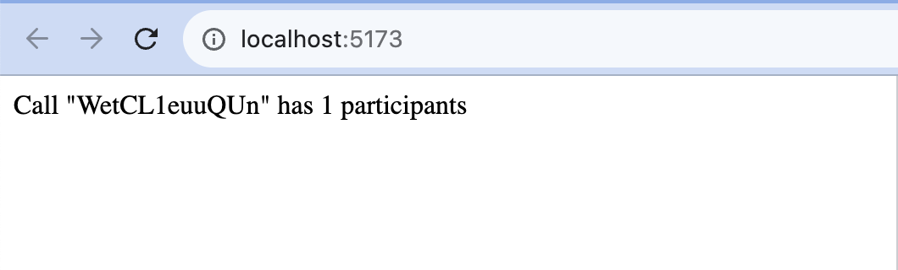
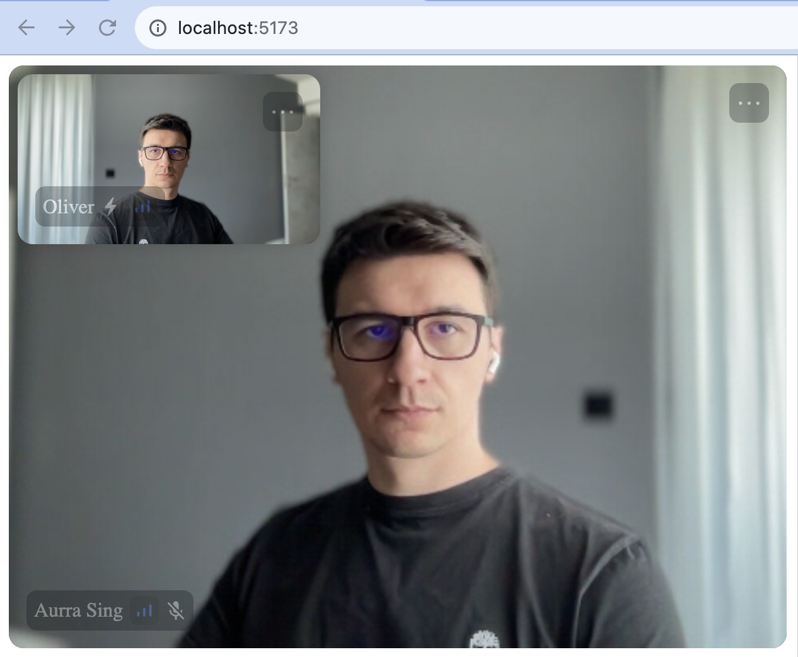
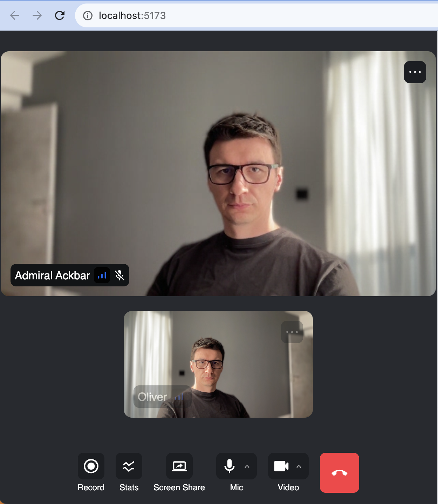

import { TokenSnippet } from '../../../shared/_tokenSnippet.jsx';

This tutorial teaches you how to build Zoom/Whatsapp style video calling experience for your app.

- Calls run on Stream's global edge network for optimal latency & reliability.
- Permissions give you fine grained control over who can do what.
- Video quality and codecs are automatically optimized.
- Powered by Stream's [Video Calling API](https://getstream.io/video/video-calling/).

### Step 1 - Setup an app and install React Video SDK

In this step, we will create a new React application using the [Vite CLI](https://vitejs.dev/), and install Stream's React Video SDK.
We recommend using Vite because it's fast and easy to use.

```bash title="Terminal"
yarn create vite video-call --template react-ts
cd video-call
yarn add @stream-io/video-react-sdk
```

### Step 2 - Create & Join a call

Open up `src/App.tsx` and replace it with this code:

```tsx title="src/App.tsx"
import { useEffect, useState } from 'react';
import {
  Call,
  CallingState,
  StreamCall,
  StreamVideo,
  StreamVideoClient,
  useCall,
  useCallCallingState,
  useParticipantCount,
  User,
} from '@stream-io/video-react-sdk';

const apiKey = 'REPLACE_WITH_API_KEY'; // the API key can be found in the "Credentials" section
const token = 'REPLACE_WITH_TOKEN'; // the token can be found in the "Credentials" section
const userId = 'REPLACE_WITH_USER_ID'; // the user id can be found in the "Credentials" section
const callId = 'REPLACE_WITH_CALL_ID'; // the call id can be found in the "Credentials" section

// set up the user object
const user: User = {
  id: userId,
  name: 'Oliver',
  image: 'https://getstream.io/random_svg/?id=oliver&name=Oliver',
};

const client = new StreamVideoClient({ apiKey, user, token });

export default function App() {
  const [call, setCall] = useState<Call>();
  useEffect(() => {
    const myCall = client.call('default', callId);
    myCall.join({ create: true }).catch((err) => {
      console.error(`Failed to join the call`, err);
    });

    setCall(myCall);

    return () => {
      setCall(undefined);
      myCall.leave().catch((err) => {
        console.error(`Failed to leave the call`, err);
      });
    };
  }, []);

  if (!call) return null;

  return (
    <StreamVideo client={client}>
      <StreamCall call={call}>
        <UILayout />
      </StreamCall>
    </StreamVideo>
  );
}

export const UILayout = () => {
  const call = useCall();
  const callingState = useCallCallingState();
  const participantCount = useParticipantCount();

  if (callingState !== CallingState.JOINED) {
    return <div>Loading...</div>;
  }

  return (
    <div>
      Call "{call.id}" has {participantCount} participants
    </div>
  );
};
```

To actually run this sample we need a valid user token. The user token is typically generated by your server side API.
When a user logs in to your app you return the user token that gives them access to the call.
To make this tutorial easier to follow we'll generate a user token for you:

Please update **REPLACE_WITH_USER_ID**, **REPLACE_WITH_TOKEN** and **REPLACE_WITH_CALL_ID** with the actual values shown below:

<TokenSnippet sampleApp="meeting" />

Now when you run the sample app it will connect successfully. The text will say "Call ... has 1 participant" (yourself).



Let's review what we did in the above code.

#### User setup

First we create a user object. You typically sync these users via a server side integration from your own backend. Alternatively, you can also use guest or anonymous users.

```ts
import type { User } from '@stream-io/video-react-sdk';

const user: User = {
  id: userId,
  name: 'Oliver',
  image: 'https://getstream.io/random_svg/?id=oliver&name=Oliver',
};
```

#### Client setup

Next we initialize the client by passing the API Key, user and user token.

```ts
import { StreamVideoClient } from '@stream-io/video-react-sdk';

const client = new StreamVideoClient({ apiKey, user, token });
```

#### Create and join call

After the user and client are created, we create a call like this:

```ts
const [call, setCall] = useState<Call>();
useEffect(() => {
  const myCall = client.call('default', callId);
  myCall.join({ create: true }).catch((err) => {
    console.error(`Failed to join the call`, err);
  });

  setCall(myCall);

  return () => {
    setCall(undefined);
    myCall.leave().catch((err) => {
      console.error(`Failed to leave the call`, err);
    });
  };
}, []);
```

As soon as you use `call.join()` the connection for video & audio is setup.

Lastly, the UI is rendered by observing the call state through the state hooks (participants and connection states):

```tsx
import {
  useCallCallingState,
  useParticipantCount,
} from '@stream-io/video-react-sdk';

const callingState = useCallCallingState();
const participantCount = useParticipantCount();
```

You'll find all relevant state for the call in `call.state` also exposed through a set of SDK provided hooks.
The documentation on [Call and Participant state](../../guides/call-and-participant-state/) explains this in further detail.

### Step 3 - Joining from the web

To make this a little more interactive, let's join the call from your browser.

<TokenSnippet sampleApp="meeting" displayStyle="join" />

In your browser, you'll see the text update to 2 participants. Let's keep the browser tab open as you go through the tutorial.

### Step 4 - Rendering Video

In this next step we're going to render your local & remote participants video.

Let's update our `UILayout` component to load the predefined SDK stylesheet, apply the default theme and render the video.

```tsx title="src/App.tsx"
import {
  CallingState,
  StreamTheme,
  useCallCallingState,
  useLocalParticipant,
  useRemoteParticipants,
} from '@stream-io/video-react-sdk';

import '@stream-io/video-react-sdk/dist/css/styles.css';

export const UILayout = () => {
  const callingState = useCallCallingState();
  const localParticipant = useLocalParticipant();
  const remoteParticipants = useRemoteParticipants();

  if (callingState !== CallingState.JOINED) {
    return <div>Loading...</div>;
  }

  return (
    <StreamTheme>
      <ParticipantList participants={remoteParticipants} />
      <FloatingLocalParticipant participant={localParticipant} />
    </StreamTheme>
  );
};
```

We will now create a `ParticipantList` component that will render the remote participants video.

```tsx title="src/App.tsx"
import {
  ParticipantView,
  StreamVideoParticipant,
} from '@stream-io/video-react-sdk';

export const ParticipantList = (props: {
  participants: StreamVideoParticipant[];
}) => {
  const { participants } = props;
  return (
    <div style={{ display: 'flex', flexDirection: 'row', gap: '8px' }}>
      {participants.map((participant) => (
        <ParticipantView
          participant={participant}
          key={participant.sessionId}
        />
      ))}
    </div>
  );
};
```

```tsx title=src/App.tsx
import {
  ParticipantView,
  StreamVideoParticipant,
} from '@stream-io/video-react-sdk';

export const FloatingLocalParticipant = (props: {
  participant?: StreamVideoParticipant;
}) => {
  const { participant } = props;
  return (
    <div
      style={{
        position: 'absolute',
        top: '15px',
        left: '15px',
        width: '240px',
        height: '135px',
        boxShadow: 'rgba(0, 0, 0, 0.1) 0px 0px 10px 3px',
        borderRadius: '12px',
      }}
    >
      <ParticipantView participant={participant} />
    </div>
  );
};
```

Now when you run the app, you'll see your local video in a floating video element and the video from your other browser tab.
The end result should look somewhat like this:



Let's review the changes we made.

[ParticipantView](../../ui-components/core/participant-view/) is one of our primary low-level components.

```tsx
import { ParticipantView } from '@stream-io/video-react-sdk';

<ParticipantView participant={participant} key={participant.sessionId} />;
```

It only displays the video comes with some default UI elements, such as participant's name.
The video is lazily loaded, and only requested from the video infrastructure if you're actually displaying it.
So if you have a video call with 200 participants, and you show only 10 of them, you'll only receive video for 10 participants.
This is how software like Zoom and Google Meet make large calls work.

`FloatingLocalParticipant` renders a display of your own video.

```tsx
const localParticipant = useLocalParticipant();

<FloatingLocalParticipant participant={useLocalParticipant} />;
```

`ParticipantList` renders a list of remote participants.

```tsx
const remoteParticipants = useRemoteParticipants();

<ParticipantList participants={remoteParticipants} />;
```

### Step 5 - A Full Video Calling UI

The above example showed how to use the call state and React to build a basic video UI.
For a production version app, you'd want a few more UI elements:

- Indicators of when someone is speaking
- Quality of their network connection
- Layout support for more than two participants
- Labels for the participant names
- Call controls

Stream React Video SDK ships with several React components to make this easy.
You can customize the components with theming, arguments and swapping parts of them.
This is convenient if you want to quickly build a production ready calling experience for you app. (and if you need more flexibility, many customers use the above low level approach to build a UI from scratch).

To render a full calling UI, we'll leverage the [SpeakerLayout](../../ui-components/core/call-layout/) component for arranging the video elements,
and the [CallControls](../../ui-components/call/call-controls/) component for rendering the call controls.
Also, we are going to introduce a minimalistic CSS file to make the UI look a bit nicer.

```css title="src/style.css"
body,
html {
  height: 100%;
  width: 100%;
  margin: 0;
  font-family: sans-serif;
}

.str-video {
  background-color: #272a30;
  color: #ffffff;
  height: 100dvh;
  width: 100%;
  display: flex;
  flex-direction: column;
  min-width: 0;
  max-width: 100%;
}
```

```tsx title=src/App.tsx
import { useEffect, useState } from 'react';
import {
  Call,
  CallControls,
  CallingState,
  SpeakerLayout,
  StreamCall,
  StreamTheme,
  StreamVideo,
  StreamVideoClient,
  useCallCallingState,
  User,
} from '@stream-io/video-react-sdk';

import '@stream-io/video-react-sdk/dist/css/styles.css';
import './style.css';

const apiKey = 'REPLACE_WITH_API_KEY'; // the API key can be found in the "Credentials" section
const token = 'REPLACE_WITH_TOKEN'; // the token can be found in the "Credentials" section
const userId = 'REPLACE_WITH_USER_ID'; // the user id can be found in the "Credentials" section
const callId = 'REPLACE_WITH_CALL_ID'; // the call id can be found in the "Credentials" section

const user: User = {
  id: userId,
  name: 'Oliver',
  image: 'https://getstream.io/random_svg/?id=oliver&name=Oliver',
};

const client = new StreamVideoClient({ apiKey, user, token });

export default function App() {
  const [call, setCall] = useState<Call>();
  useEffect(() => {
    const myCall = client.call('default', callId);
    myCall.join({ create: true }).catch((err) => {
      console.error(`Failed to join the call`, err);
    });

    setCall(myCall);

    return () => {
      setCall(undefined);
      myCall.leave().catch((err) => {
        console.error(`Failed to leave the call`, err);
      });
    };
  }, []);

  if (!call) return null;

  return (
    <StreamVideo client={client}>
      <StreamCall call={call}>
        <UILayout />
      </StreamCall>
    </StreamVideo>
  );
}

export const UILayout = () => {
  const callingState = useCallCallingState();
  if (callingState !== CallingState.JOINED) {
    return <div>Loading...</div>;
  }

  return (
    <StreamTheme>
      <SpeakerLayout participantsBarPosition="bottom" />
      <CallControls />
    </StreamTheme>
  );
};
```

The final UI should look like this:



When you now run your app, you'll see a more polished video UI.
It supports reactions, screensharing, active speaker detection, network quality indicators etc. The most commonly used UI components are:

- [ParticipantView](../../ui-components/core/participant-view/): For rendering video and automatically requesting video tracks when needed. Most of the Video components are built on top of this.
- [DefaultParticipantViewUI](../../ui-components/core/participant-view/#participantviewui): The participant's video + some UI elements for network quality, reactions, speaking etc. `ParticipantView` uses this UI by default.
- [PaginatedGridLayout](../../ui-components/core/call-layout/): A grid of participants. Support pagination out of the box.
- [SpeakerLayout](../../ui-components/core/call-layout/): A layout that shows the active speaker in a large video, and the rest of the participants a scrollable bar.
- [CallControls](../../ui-components/call/call-controls/): A set of buttons for controlling your call, such as changing audio and video mute state, switching mic or a camera.

The full list of [UI components](../../ui-components/overview) is available in the docs.

### Step 6 - Customizing the UI

You can customize the UI by:

- Building your own UI components (the most flexibility, build anything).
- Mixing and matching with Stream's UI Components (speeds up how quickly you can build custom video UIs).
- Theming (basic customization of colors, fonts etc).

You can find many examples on how to build your own custom UI components in our [UI Cookbook docs](../../ui-cookbook/overview/).

### Recap

Please do let us know if you ran into any issues while building an video calling app with React Video SDK.
Our team is also happy to review your UI designs and offer recommendations on how to achieve it with Stream.

To recap what we've learned:

- You setup a call: `const call = client.call('default', '123');`.
- The call type (`'default'` in the above case) controls which features are enabled and how permissions are setup.
- When you join a call, realtime communication is setup for audio & video calling: `call.join()`.
- Call state `call.state` and helper state access hooks as `useLocalParticipant` make it easy to build your own UI
- `ParticipantView` is the low level component that renders video, plays audio and by default, it utilizes `DefaultParticipantViewUI` that adds UI elements as participant name, network quality, etc...

We've used [Stream's Video Calling API](https://getstream.io/video/video-calling/),
which means calls run on a global edge network of video servers.
By being closer to your users the latency and reliability of calls are better.
The React SDK enables you to build in-app [video calling, audio rooms and livestreaming](https://getstream.io/video/) in days.

The source code for the final app can be found in our [GitHub repository](https://github.com/GetStream/stream-video-js/tree/main/sample-apps/react/stream-video-react-tutorial).

We hope you've enjoyed this tutorial and please do feel free to reach out if you have any suggestions or questions.
