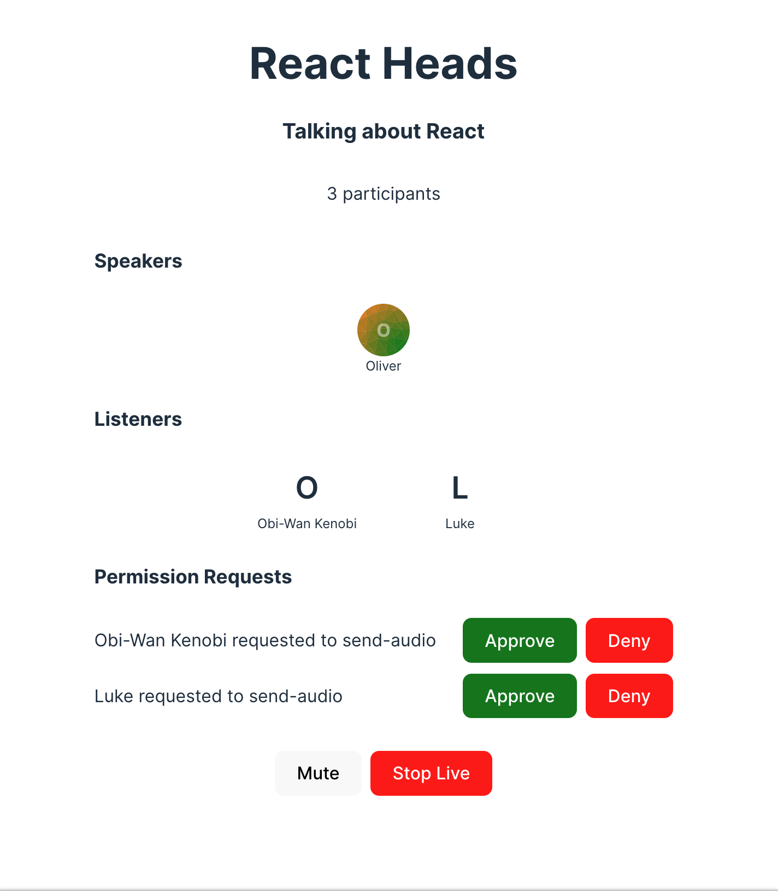

import { TokenSnippet } from '../../../shared/_tokenSnippet.jsx';

This tutorial will teach you how to build an audio room experience like Twitter Spaces or Clubhouse.
The end result will look like the image below and will support the following features:

- Backstage mode. You can start the call with your co-hosts and chat a bit before going live
- Calls run on Stream's global edge network for optimal latency and scalability
- There is no cap to how many listeners you can have in a room
- Listeners can raise their hand, and be invited to speak by the host
- Audio tracks are sent multiple times for optimal reliability



Time to get started building an audio-room for your app.

### Step 1 - Create a new React app and install the React Video SDK

In this step, we will create a new React application using the Vite CLI, and install Stream's React Video SDK.
We recommend using [Vite](https://vitejs.dev/) because it's fast and easy to use.

```bash title="Terminal"
yarn create vite audio-rooms --template react-ts
cd audio-rooms
yarn add @stream-io/video-react-sdk
```

### Step 2 - Create & Join a call

Open up `src/App.tsx` and replace it with this code:

```tsx title="src/App.tsx"
import { useEffect, useState } from 'react';
import {
  StreamCall,
  StreamVideo,
  StreamVideoClient,
  User,
} from '@stream-io/video-react-sdk';
import '@stream-io/video-react-sdk/dist/css/styles.css';

const apiKey = 'REPLACE_WITH_API_KEY'; // the API key can be found in the "Credentials" section
const token = 'REPLACE_WITH_TOKEN'; // the token can be found in the "Credentials" section
const userId = 'REPLACE_WITH_USER_ID'; // the user_id can be found in the "Credentials" section
const callId = 'REPLACE_WITH_CALL_ID'; // the call_id can be found in the "Credentials" section

// initialize the user object
const user: User = {
  id: userId,
  name: 'Oliver',
  image: 'https://getstream.io/random_svg/?id=oliver&name=Oliver',
};

// initialize the StreamVideoClient
const client = new StreamVideoClient({ apiKey, user, token });

export default function App() {
  // initialize the call object
  const [call] = useState(() => client.call('audio_room', callId));
  useEffect(() => {
    call
      .join({
        create: true,
        data: {
          members: [{ user_id: 'john_smith' }, { user_id: 'jane_doe' }],
          custom: {
            title: 'React Rooms',
            description: 'Talking about React',
          },
        },
      })
      .catch((err) => {
        console.error(`Error joining the call`, err);
      })
      .then(() => {
        console.log(`Successfully joined the call`);
      });
  }, [call]);

  return (
    <StreamVideo client={client}>
      <StreamCall call={call}>
        <UILayout /> // we'll add the UI components here later
      </StreamCall>
    </StreamVideo>
  );
}
```

Let's review the example above and go over the details.

#### User setup

First we create a user object. You typically sync your users via a server side integration from your own backend.
Alternatively, you can also use guest or anonymous users.

```ts
import type { User } from '@stream-io/video-react-sdk';

const user: User = {
  id: userId,
  name: 'Oliver',
  image: 'https://getstream.io/random_svg/?id=oliver&name=Oliver',
};
```

#### Client setup

Next, we initialize the client by passing the API Key, user and user token.

```ts
import { StreamVideoClient } from '@stream-io/video-react-sdk';

const client = new StreamVideoClient({ apiKey, user, token });
```

#### Create and join call

After the user and client are created, we create a call like this:

```tsx
const [call] = useState(() => client.call('audio_room', callId));
useEffect(() => {
  call
    .join({
      create: true,
      data: {
        members: [{ user_id: 'john_smith' }, { user_id: 'jane_doe' }],
        custom: {
          title: 'React Heads',
          description: 'Talking about React',
        },
      },
    })
    .catch((err) => {
      console.error(`Error joining the call`, err);
    })
    .then(() => {
      console.log(`Successfully joined the call`);
    });
}, [call]);
```

- This joins and creates a call with the type: `audio_room` and the specified `callId`
- The users with id `john_smith` and `jane_doe` are added as members to the call
- And we set the `title` and `description` custom field on the call object

To actually run this sample we need a valid user token. The user token is typically generated by your server side API.
When a user logs in to your app you return the user token that gives them access to the call.
To make this tutorial easier to follow we'll generate a user token for you:

Please update **REPLACE_WITH_USER_ID**, **REPLACE_WITH_TOKEN** and **REPLACE_WITH_CALL_ID** with the actual values shown below:

<TokenSnippet sampleApp="audio-rooms" />

With valid credentials in place, we can join the call.

### Step 3 - Adding audio room UI elements

In this next step we'll add:

- Room title and description
- Controls to toggle live mode on/off
- A list of participants with their speaking status

#### Room Title & Description

Let's create the components we need to render this and add them to the main app

```tsx title=DescriptionPanel.tsx
import { useCallMetadata, useParticipants } from '@stream-io/video-react-sdk';

export const DescriptionPanel = () => {
  const participants = useParticipants();
  const metadata = useCallMetadata();
  const custom = metadata?.custom;
  return (
    <div className="description-panel">
      <h2 className="title">{custom?.title ?? '<Title>'}</h2>
      <h3 className="description">{custom?.description ?? '<Description>'}</h3>
      <p className="participant-count">{participants.length} participants</p>
    </div>
  );
};
```

```tsx title=ParticipantsPanel.tsx
import { Avatar, useParticipants } from '@stream-io/video-react-sdk';

export const ParticipantsPanel = () => {
  const participants = useParticipants();
  return (
    <div className="participants-panel">
      <h4>Participants</h4>
      {participants.map((participant) => {
        return (
          <div className="participant" key={participant.sessionId}>
            <Avatar imageSrc={participant.image} />
            <div>{participant.name}</div>
          </div>
        );
      })}
    </div>
  );
};
```

```tsx title=ControlsPanel.tsx
export const ControlsPanel = () => {
  return (
    <div className="controls-panel">
      <MicButton /> // we'll add this later
      <LiveButton /> // we'll add this later
    </div>
  );
};
```

That's it for the basics, here's how the app `UILayout` should look like now:

```tsx title=UILayout.tsx
export const UILayout = () => {
  return (
    <div className="ui-layout">
      <DescriptionPanel />
      <ParticipantsPanel />
      <ControlsPanel />
    </div>
  );
};
```

The approach is the same for all components.
We take the states of the call by observing `call.state` updates through the SDK provided hooks,
such as `useParticipants()` or `useCallMetadata()` and use it to power our UI.

:::note
In React, all `call.state` properties can be accessed via a set of utility hooks.
This makes it easier to build UI components that react to changes in the call state.

Read more about it at [Call & Participant State](../../guides/call-and-participant-state/).
:::

To make this a little more interactive, let's join the audio room from the browser.

<TokenSnippet sampleApp="audio-rooms" displayStyle="join" />

#### Backstage & Live mode control

As you probably noticed by opening the same room from the browser, audio rooms by default are not live.
Regular users can only join an audio room when it is in live mode.
Let's expand the `ControlPanel` and add a button that controls the backstage of the room.

```tsx title=LiveButton.tsx
import { useCall, useIsCallLive } from '@stream-io/video-react-sdk';

export const LiveButton = () => {
  const call = useCall();
  const isLive = useIsCallLive();
  return (
    <button
      className="live-button"
      onClick={() => {
        if (isLive) {
          call?.stopLive().catch((err) => {
            console.error(`Error stopping live`, err);
          });
        } else {
          call?.goLive().catch((err) => {
            console.error(`Error starting live`, err);
          });
        }
      }}
    >
      {isLive ? 'Stop Live' : 'Go Live'}
    </button>
  );
};
```

While we're at it, let's also add a button that allows to mute/unmute the local audio track:

```tsx title=MicButton.tsx
import {
  SfuModels,
  useLocalParticipant,
  useMediaDevices,
} from '@stream-io/video-react-sdk';

export const MicButton = () => {
  const { publishAudioStream, stopPublishingAudio } = useMediaDevices();

  const localParticipant = useLocalParticipant();
  const isMuted = !localParticipant?.publishedTracks.includes(
    SfuModels.TrackType.AUDIO,
  );

  return (
    <button
      className="mic-button"
      onClick={() => {
        if (isMuted) {
          publishAudioStream().catch((err) => {
            console.error(`Error publishing audio stream`, err);
          });
        } else {
          stopPublishingAudio();
        }
      }}
    >
      {isMuted ? 'Unmute' : 'Mute'}
    </button>
  );
};
```

Now the app exposes a mic control button and a button that allows to toggle live mode on/off.
If you try the web demo of the audio room you should be able to join as a regular user.

#### List Participants

As a next step, let's render the actual list of participants and show an indicator when they are speaking.
To do this we are going to create a `Participant` component and render it from the `ParticipantsPanel`

```tsx title=Participant.tsx
import { Avatar, StreamVideoParticipant } from '@stream-io/video-react-sdk';
export const Participant = ({
  participant,
}: {
  participant: StreamVideoParticipant;
}) => {
  // `isSpeaking` information is available on the participant object
  // and it is automatically detected by our system and updated by our SDK.
  const { isSpeaking } = participant;
  return (
    <div className={`participant ${isSpeaking ? 'speaking' : ''}`}>
      <Avatar imageSrc={participant.image} />
      <div className="name">{participant.name}</div>
    </div>
  );
};
```

```tsx title=ParticipantsPanel.tsx
import { useParticipants } from '@stream-io/video-react-sdk';
import { Participant } from './Participant';

export const ParticipantsPanel = () => {
  // whenever a participant receives an update, this hook will re-render
  // the component with the updated list of participants, ensuring that
  // the UI is always in sync with the call state.
  const participants = useParticipants();
  return (
    <div className="participants-panel">
      <h4>Participants</h4>
      {participants.map((participant) => (
        <Participant participant={participant} key={participant.sessionId} />
      ))}
    </div>
  );
};
```

With these changes things get more interesting, the app is now showing a list of all participants connected to the call
and displays a green frame around the ones that are speaking.

### Step 4 - Go live and join from the browser

If you now join the call from the browser you will see that the participant list updates as you open/close the browser tab.

:::note
Note how the web interface won't allow you to share your audio/video.
The reason for this is that by default the `audio_room` call type only allows moderators or admins to speak.
Regular participants can request permission.
And if different defaults make sense for your app you can edit the call type in the dashboard or create your own.
:::

### Step 5 - Requesting permission to speak

Requesting permission to speak is easy. Let's first have a quick look at how the SDK call object exposes this:

#### Requesting permission to speak

```tsx
import { OwnCapability } from '@stream-io/video-react-sdk';

await call.requestPermissions({
  permissions: [OwnCapability.SEND_AUDIO],
});
```

#### Handling permission requests

Permission requests are delivered to the call object in a form of an event one can subscribe to:

```ts
import type { PermissionRequestEvent } from '@stream-io/video-react-sdk';

call.on(
  'call.permission_requested',
  async (request: PermissionRequestEvent) => {
    // get the permission request data
    const { user, permissions } = request;

    // reject it
    await call.revokePermissions(user.id, permissions);

    // grant it
    await call.grantPermissions(user.id, permissions);
  },
);
```

Let's add another view that shows the last incoming request as well as the buttons to grant / reject it

```tsx title=PermissionRequestsPanel.tsx
import { useCall, PermissionRequestEvent } from '@stream-io/video-react-sdk';
import { useCallback, useEffect, useState } from 'react';

export const PermissionRequestsPanel = () => {
  // this hook will take the call instance from the <StreamCall /> context.
  const call = useCall();
  const [permissionRequests, setPermissionRequests] = useState<
    PermissionRequestEvent[]
  >([]);
  useEffect(() => {
    return call?.on('call.permission_request', (event) => {
      const request = event as PermissionRequestEvent;
      setPermissionRequests((reqs) => [...reqs, request]);
    });
  }, [call]);

  const handlePermissionRequest = useCallback(
    async (request: PermissionRequestEvent, accept: boolean) => {
      const { user, permissions } = request;
      try {
        if (accept) {
          await call?.grantPermissions(user.id, permissions);
        } else {
          await call?.revokePermissions(user.id, permissions);
        }
        setPermissionRequests((reqs) => reqs.filter((req) => req !== request));
      } catch (err) {
        console.error(`Error granting or revoking permissions`, err);
      }
    },
    [call],
  );

  if (!permissionRequests.length) return null;

  return (
    <div className="permission-requests">
      <h4>Permission Requests</h4>
      {permissionRequests.map((request) => (
        <div className="permission-request" key={request.user.id}>
          <span>
            {request.user.name} requested to {request.permissions.join(', ')}
          </span>
          <button onClick={() => handlePermissionRequest(request, true)}>
            Approve
          </button>
          <button onClick={() => handlePermissionRequest(request, false)}>
            Deny
          </button>
        </div>
      ))}
    </div>
  );
};
```

And here is the updated `UILayout` code that includes it:

```tsx title=UILayout.tsx
export const UILayout = () => {
  return (
    <div className="ui-layout">
      <DescriptionPanel />
      <ParticipantsPanel />
      // highlight-next-line
      <PermissionRequestsPanel />
      <ControlsPanel />
    </div>
  );
};
```

### Step 6 - Group participants

It is common for audio rooms and similar interactive audio/video experiences to show users in separate groups.
Let's see how we can update this application to render participants in two separate sections: speakers and listeners.

Building custom layouts is very simple, all we need to do is to apply some filtering to the result of `useParticipants()` hook.

```ts
import {
  SfuModels,
  StreamVideoParticipant,
  useParticipants,
} from '@stream-io/video-react-sdk';

// a list of participants, by default this is list is ordered by the ID of the user
const participants = useParticipants();

const hasAudio = (p: StreamVideoParticipant) =>
  p.publishedTracks.includes(SfuModels.TrackType.AUDIO);
// Speakers: participants that have an audio track (ie. are allowed to speak and have a mic configured)
const speakers = participants.filter((p) => hasAudio(p));

// Listeners: participants that do not have an audio track
const listeners = participants.filter((p) => !hasAudio(p));
```

We already have a view to display participants so all we need to do is to update it to use the new `speakers` and `listeners` arrays.

```tsx title=ParticipantsPanel.tsx
import {
  SfuModels,
  StreamVideoParticipant,
  useParticipants,
} from '@stream-io/video-react-sdk';
import { Participant } from './Participant';

export const ParticipantsPanel = () => {
  const hasAudio = (p: StreamVideoParticipant) =>
    p.publishedTracks.includes(SfuModels.TrackType.AUDIO);

  const participants = useParticipants();
  const speakers = participants.filter((p) => hasAudio(p));
  const listeners = participants.filter((p) => !hasAudio(p));

  return (
    <>
      <h4>Speakers</h4>
      <div className="participants-panel">
        {speakers.map((participant) => (
          <Participant participant={participant} key={participant.sessionId} />
        ))}
      </div>
      <h4>Listeners</h4>
      <div className="participants-panel">
        {listeners.map((participant) => (
          <Participant participant={participant} key={participant.sessionId} />
        ))}
      </div>
    </>
  );
};
```

## Other built-in features

There are a few more exciting features that you can use to build audio rooms

- [**Query Calls:**](../../guides/querying-calls/) You can query calls to easily show upcoming calls, calls that recently finished as well as call previews.
- [**Reactions & Custom events:**](../../guides/reactions-and-custom-events/) Reactions and custom events are supported.
- [**Recording**](../../advanced/recording/) & [**Broadcasting**](../../advanced/broadcasting): You can record your calls Chat Stream's chat SDKs are fully featured, and you can integrate them in the call.
- **Moderation:** Moderation capabilities are built-in to the product
- **Transcriptions:** Transcriptions aren't available yet, but they are due to launch soon

## Recap

It was fun to see just how quickly you can build an audio-room for your app.
Please do let us know if you ran into any issues.
Our team is also happy to review your UI designs and offer recommendations on how to achieve it with Stream.

To recap what we've learned:

- You set up a call with `const call = client.call('audio_room', '123')`
- The call type `audio_room` controls which features are enabled and how permissions are set up
- The `audio_room` by default enables `backstage` mode, and only allows admins and the creator of the call to join before the call goes live
- When you join a call, realtime communication is set up for audio & video calling: `await call.join()`
- Call state `call.state` and helper state access hooks make it easy to build your own UI
- Calls run on Stream's global edge network of video servers. Being closer to your users improves the latency and reliability of calls. For audio rooms we use Opus RED and Opus DTX for optimal audio quality.

The SDKs enable you to build audio rooms, video calling and livestreaming in days.

We hope you've enjoyed this tutorial and please do feel free to reach out if you have any suggestions or questions.
You can find the code and the stylesheet for this tutorial in [this CodeSandbox](https://codesandbox.io/s/audio-rooms-tutorial-glhgrg).

The source code for the companion audio room app, together with all of its features, is available on [GitHub.](https://github.com/GetStream/stream-video-js/tree/main/sample-apps/react/audio-rooms)
