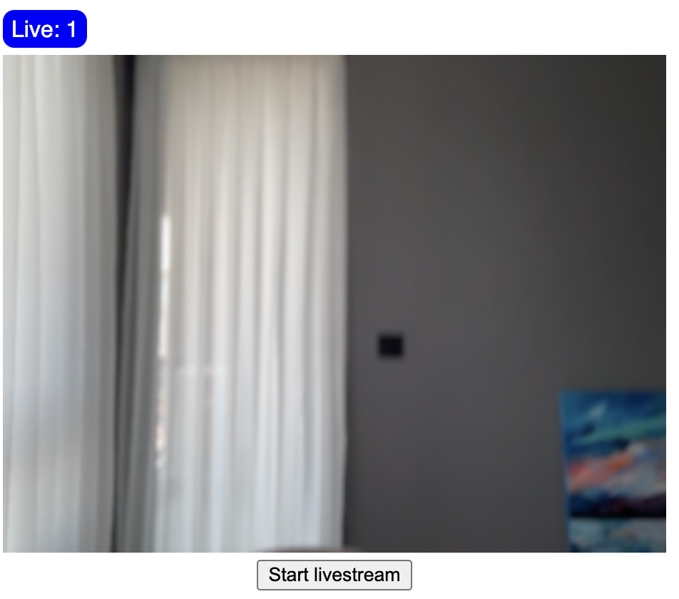

import { TokenSnippet } from '../../../shared/_tokenSnippet.jsx';

In this tutorial we'll quickly build a low-latency in-app livestreaming experience.
The livestream is broadcasted using Stream's edge network of servers around the world.

We'll cover the following topics:

- Ultra low latency streaming
- Multiple streams & co-hosts
- RTMP in and WebRTC input
- Exporting to HLS
- Reactions, custom events and chat
- Recording & Transcriptions

Let's get started, if you have any questions or feedback be sure to let us know via the feedback button.

### Step 1 - Create a new React app and install the React Video SDK

In this step, we will create a new React application using the [Vite CLI](https://vitejs.dev/),
and install Stream's React Video SDK.
We recommend using Vite because it's fast and easy to use.

```bash title="Terminal"
yarn create vite livestream-app --template react-ts
cd livestream-app
yarn add @stream-io/video-react-sdk
```

### Step 2 - Broadcast a livestream from your device

The following code shows how to publish from your device's camera.
Let's open `App.tsx` and replace its contents with the following code:

```tsx title=App.tsx
import { useEffect, useState } from 'react';
import { Call, StreamVideoClient, User } from '@stream-io/video-react-sdk';

const apiKey = 'REPLACE_WITH_API_KEY'; // the API key can be found in the "Credentials" section
const token = 'REPLACE_WITH_TOKEN'; // the token can be found in the "Credentials" section
const userId = 'REPLACE_WITH_USER_ID'; // the user id can be found in the "Credentials" section
const callId = 'REPLACE_WITH_CALL_ID'; // the call id can be found in the "Credentials" section

// set up the user object
const user: User = {
  id: userId,
  name: 'Oliver',
  image: 'https://getstream.io/random_svg/?id=oliver&name=Oliver',
};

export default function App() {
  const [client, setClient] = useState<StreamVideoClient>();
  const [call, setCall] = useState<Call>();

  useEffect(() => {
    const myClient = new StreamVideoClient({ apiKey, user, token });
    setClient(myClient);
    return () => {
      myClient.disconnectUser();
      setClient(undefined);
    };
  }, []);

  useEffect(() => {
    if (!client) return;
    const myCall = client.call('livestream', callId);
    myCall.join({ create: true }).catch((err) => {
      console.error(`Failed to join the call`, err);
    });

    setCall(myCall);

    return () => {
      setCall(undefined);
      myCall.leave().catch((err) => {
        console.error(`Failed to leave the call`, err);
      });
    };
  }, [client]);

  if (!client || !call) return null;

  return <LivestreamUI />;
}

export const LivestreamUI = () => {
  return <div>TODO: render video</div>;
};
```

If you run the app now, you'll see that the client fails to connect.
In order to fix that, we need to provide valid credentials. They shall be set in the following varialbes:

```ts
const apiKey = 'REPLACE_WITH_API_KEY';
const token = 'REPLACE_WITH_TOKEN';
const userId = 'REPLACE_WITH_USER_ID';
const callId = 'REPLACE_WITH_CALL_ID';
```

Replace them now with the appropriate values from the table below:

<TokenSnippet sampleApp="livestream" displayStyle="credentials" />

When you run the app now you'll see a text message saying: `TODO: render video`.

Before we get around to rendering the video let's review the code above.

#### User setup

First we create a user object.
You typically sync these users via a server side integration from your own backend.
Alternatively, you can also use guest or anonymous users.

```ts
import type { User } from '@stream-io/video-react-sdk';

const user: User = {
  id: userId,
  name: 'Oliver',
  image: 'https://getstream.io/random_svg/?id=oliver&name=Oliver',
};
```

#### Client setup

Next, we initialize the client by passing the API Key, user and user token.
Note that we're using the `useEffect` hook to initialize the client in a `React.StrictMode` compatible way.

```ts
import { useEffect, useState } from 'react';
import { StreamVideoClient } from '@stream-io/video-react-sdk';

const [client, setClient] = useState<StreamVideoClient>();
useEffect(() => {
  const myClient = new StreamVideoClient({ apiKey, user, token });
  setClient(myClient);
  return () => {
    myClient.disconnectUser();
    setClient(undefined);
  };
}, []);
```

#### Create and join call

The most important step to review is how we create the call.
Stream uses the same call object for livestreaming, audio rooms and video calling.
Have a look at the code snippet below:

```ts
import { useEffect, useState } from 'react';
import { Call, StreamVideoClient } from '@stream-io/video-react-sdk';

// the client created in the previous step
const [client, setClient] = useState<StreamVideoClient>();

const [call, setCall] = useState<Call>();
useEffect(() => {
  if (!client) return;
  const myCall = client.call('livestream', callId);
  myCall.join({ create: true }).catch((err) => {
    console.error(`Failed to join the call`, err);
  });

  setCall(myCall);

  return () => {
    setCall(undefined);
    myCall.leave().catch((err) => {
      console.error(`Failed to leave the call`, err);
    });
  };
}, [client]);
```

To create the first call object, specify the call type as `livestream` and provide a unique `callId`.

The **livestream** call type comes with default settings that are usually suitable for livestreams,
but you can customize features, permissions, and settings in the dashboard.
Additionally, the dashboard allows you to create new call types as required.
For more information, check the [Call Types](../../guides/configuring-call-types/) docs.

Finally, using `call.join({ create: true })` will not only create the call object on our servers but also initiate the real-time transport for audio and video.
This allows for seamless and immediate engagement in the livestream.

Note that you can also add members to a call and assign them different roles.
For more information, see the [Joining & Creating Calls](../../guides/joining-and-creating-calls/).

### Step 3 - Rendering the video

In this step we're going to build a UI for showing your local video with a button to start the livestream.

In `App.tsx` replace the `LivestreamUI` component with the following code:

```tsx
import {
  useCall,
  useLocalParticipant,
  useParticipantCount,
  useIsCallLive,
  ParticipantView,
} from '@stream-io/video-react-sdk';

// add styles for the video UI
import '@stream-io/video-react-sdk/dist/css/styles.css';

export const LivestreamUI = () => {
  const call = useCall();
  const totalParticipants = useParticipantCount();
  const localParticipant = useLocalParticipant();
  const isCallLive = useIsCallLive();
  return (
    <div style={{ display: 'flex', flexDirection: 'column', gap: '5px' }}>
      <div
        style={{
          alignSelf: 'flex-start',
          color: 'white',
          backgroundColor: 'blue',
          borderRadius: '8px',
          padding: '4px 6px',
        }}
      >
        Live: {totalParticipants}
      </div>
      <div style={{ flex: 1 }}>
        {localParticipant && (
          <ParticipantView
            participant={localParticipant}
            // disables the extra UI elements as such:
            // name, audio, video indicator, etc...
            ParticipantViewUI={null}
          />
        )}
      </div>
      <div style={{ alignSelf: 'center' }}>
        {isCallLive ? (
          <button onClick={() => call?.stopLive()}>Stop Livestream</button>
        ) : (
          <button onClick={() => call?.goLive()}>Start Livestream</button>
        )}
      </div>
    </div>
  );
};
```

Upon running your app, you will be greeted with an interface that looks like this:



Stream uses a technology called SFU cascading to replicate your livestream over different SFUs around the world.
This makes it possible to reach a large audience in realtime.

Now let's press **Start Livestream** in your new app and click the **Join Call** button below to watch your livestream in another tab in your browser:

<TokenSnippet sampleApp="livestream" displayStyle="join" />

Let's take a moment to review the code above.

You can see we use a few hooks to get the call state. The most important ones are:

```ts
const totalParticipants = useParticipantCount();
const localParticipant = useLocalParticipant();
const isCallLive = useIsCallLive();
```

The [Call & Participant state](../../guides/call-and-participant-state/) lists all available hoos you can use for accessing call and participant state.

The layout is built using standard React DOM elements.
The [ParticipantView](../../ui-components/core/participant-view/) component is provided by Stream's React Video SDK.
**ParticipantView** renders the video and a fallback. You can use it for rendering the local and remote video.

#### Backstage mode

In the example above you might have noticed the `call.goLive()` method and the `isCallLive` value.
The backstage functionality is enabled by default on the livestream call type.
It makes it easy to build a flow where you and your co-hosts can setup your camera and equipment before going live.
Only after you call `call.goLive()` will regular users be allowed to join the livestream.

This is convenient for many livestreaming and audio-room use cases. If you want calls to start immediately when you join them that's also possible.
Simply go the Stream dashboard, click the livestream call type and disable the backstage mode.

### Step 4 - (Optional) Publishing RTMP using OBS

The example above showed how to publish your device camera to the livestream.
Almost all livestream software and hardware supports RTMPS.
[OBS](https://obsproject.com/) is one of the most popular livestreaming software packages and we'll use it to explain how to import RTMPS.
So let's see how to publish using RTMPs. Feel free to skip this step if you don't need to use RTMPs.

#### Log the URL & Stream Key

```ts
import { useCallMetadata } from '@stream-io/video-react-sdk';

const metadata = useCallMetadata();
const rtmpURL = metadata?.ingress?.rtmp.address;
const streamKey = `${apiKey}/${token}`;

console.log('RTMP url:', rtmpURL, 'Stream key:', streamKey);
```

#### Open OBS and go to settings -> stream

- Select "custom" service
- Server: equal to the `rtmpURL` from the log
- Stream key: equal to the `streamKey` from the log

Press start streaming in OBS. The RTMP stream will now show up in your call just like a regular video participant.

Now that we've learned to publish using WebRTC or RTMP let's talk about watching the livestream.

### Step 5 - Viewing a livestream (WebRTC)

Watching a livestream is even easier than broadcasting.

Compared to the current code in in `App.tsx` you:

- Don't render the local video, but instead render the remote videos - `useRemoteParticipants` instead of `useLocalParticipant`
- Typically include some small UI elements like viewer count, a button to mute etc.

### Step 6 - (Optional) Viewing a livestream with HLS

Another way to watch a livestream is using HLS. HLS tends to have a 10 to 20 seconds delay, while the above WebRTC approach is realtime.
The benefit that HLS offers is better buffering under poor network conditions.
So HLS can be a good option when:

- A 10-20 second delay is acceptable
- Your users want to watch the Stream in poor network conditions

Let's show how to broadcast your call to HLS:

```ts
import { useCall, useCallMetadata } from '@stream-io/video-react-sdk';

const call = useCall();
await call.startHLS();

// take the URL to the M3U8 playlist
const metadata = useCallMetadata();
const playlistUrl = metadata?.egress?.hls?.playlistUrl;
console.log('HLS playlist url:', playlistUrl);
```

You can view the HLS video feed using any HLS capable video player.

### Step 7 - Advanced Features

This tutorial covered broadcasting and watching a livestream.
It also went into more details about HLS & RTMP-in.

There are several advanced features that can improve the livestreaming experience:

- ** [Co-hosts](../../guides/joining-and-creating-calls/) ** You can add members to your livestream with elevated permissions. So you can have co-hosts, moderators etc.
- ** [Custom events](../../guides/reactions-and-custom-events/) ** You can use custom events on the call to share any additional data. Think about showing the score for a game, or any other realtime use case.
- ** [Reactions & Chat](../../guides/reactions-and-custom-events/) ** Users can react to the livestream, and you can add chat. This makes for a more engaging experience.
- ** [Recording](../../advanced/recording/) ** The call recording functionality allows you to record the call with various options and layouts

### Recap

It was fun to see just how quickly you can build in-app low latency livestreaming.
Please do let us know if you ran into any issues.
Our team is also happy to review your UI designs and offer recommendations on how to achieve it with Stream.

To recap what we've learned:

- WebRTC is optimal for latency, HLS is slower but buffers better for users with poor connections
- You setup a call: `const call = client.call("livestream", callId)`
- The call type `"livestream"` controls which features are enabled and how permissions are setup
- The livestream by default enables "backstage" mode. This allows you and your co-hosts to setup your mic and camera before allowing people in
- When you join a call, realtime communication is setup for audio & video: `await call.join()`
- Call state `call.state` and helper state access hooks make it easy to build your own UI

We've used [Stream's Livestream API](https://getstream.io/video/livestreaming/),
which means calls run on a global edge network of video servers.
By being closer to your users the latency and reliability of calls are better.
The React SDK enables you to build in-app [video calling, audio rooms and livestreaming](https://getstream.io/video/) in days.

We hope you've enjoyed this tutorial and please do feel free to reach out if you have any suggestions or questions.
You can find the code for this tutorial in [this CodeSandbox](https://codesandbox.io/s/livestream-tutorial-mlqtrd).

The source code for the companion Livestreaming App, together with all of its features, is available on [Github.](https://github.com/GetStream/stream-video-js/tree/main/sample-apps/react/livestream-app)
