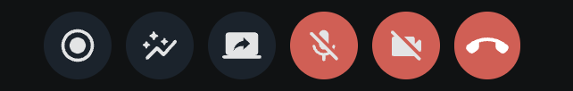

Call control actions allow users to execute actions during a call (for example, start recording), and/or before joining (for example, mute/unmute microphone). The built-in `CallControls` component displays all relevant call controls during a call. Each call control is available to use as separate component.

## General usage

The `CallControls` component displays the available call controls (based on [user permissions](../../../guides/permissions-and-moderation)).

```tsx
import '@stream-io/video-react-sdk/dist/css/styles.css';
import {
  Call,
  CallControls,
  StreamCall,
  SpeakerLayout,
} from '@stream-io/video-react-sdk';

const CallUI = () => {
  let call: Call;

  return (
    <StreamCall call={call}>
      <SpeakerLayout />
      // highlight-next-line
      <CallControls />
    </StreamCall>
  );
};
```

## Props

### `onLeave`

| Type                        |
| --------------------------- |
| `() => void` \| `undefined` |

A callback to be called after the call is left using the hangup button.

## Built-in call controls

Each call control is available as a separate UI component. Each component takes care of authorization.

### `AcceptCallButton`

This component is used in the [ringing call component](../ringing-call) to accept an incoming call.

#### Props

| Name       | Description                                            | Type                                                  |
| ---------- | ------------------------------------------------------ | ----------------------------------------------------- |
| `disabled` | Set `true` to disable the button                       | `boolean` \| `undefined`                              |
| `onClick`  | Event handler to override the default click behavior   | `MouseEventHandler<HTMLButtonElement>` \| `undefined` |
| `onAccept` | Custom event handler to call after the call was joined | `() => void` \| `undefined`                           |

### AudioOutputLevelSlider

The component allows to set the audio output level. This can be

- the master level applied to control the sound volume for all audio streams arriving from remote participants (if no `participant` is specified in props)
- the audio level for a specific participant (to lower the volume of a participant that speaks too loud or increase for those inaudible)

#### Props


| Name       | Description                                          | Type                                                  |
| ---------- | ---------------------------------------------------- | ----------------------------------------------------- |
| `participant` | Participant whose sound volume is to be adjusted.                     | `StreamVideoParticipant` \| `undefined`                              |

### `CancelCallButton`

This component can be used to leave a call or to reject an incoming/outgoing call.

#### Props

| Name       | Description                                          | Type                                                  |
| ---------- | ---------------------------------------------------- | ----------------------------------------------------- |
| `disabled` | Set `true` to disable the button                     | `boolean` \| `undefined`                              |
| `onClick`  | Event handler to override the default click behavior | `MouseEventHandler<HTMLButtonElement>` \| `undefined` |
| `onLeave`  | Custom event handler to call after the call was left | `() => void` \| `undefined`                           |

### `ReactionsButton`

This component can be used to send reactions during a call. The following reactions are supported by default:

- like 👍
- raise hand ✋
- fireworks 🎉

#### Props

| Name        | Description                                     | Type                              |
| ----------- | ----------------------------------------------- | --------------------------------- |
| `reactions` | Override or extend the default reactions/emojis | `StreamReaction[]` \| `undefined` |

### `RecordCallButton`

This component can be used to start/stop call recording. It's also used as a visual indicator to let participants know if there is an ongoing call recording.

#### Props

| Name      | Description                                             | Type                    |
| --------- | ------------------------------------------------------- | ----------------------- |
| `caption` | The explanatory text displayed under the control button | `string` \| `undefined` |

### `ScreenShareButton`

This component can be used to start/stop screen sharing. It's also used as a visual indicator to let participants know if there is an ongoing screen share. This component only allows a single ongoing screen share.

#### Props

| Name      | Description                                             | Type                    |
| --------- | ------------------------------------------------------- | ----------------------- |
| `caption` | The explanatory text displayed under the control button | `string` \| `undefined` |

### `ToggleAudioPreviewButton`

This component can be used to toggle the [initial audio state](../../../guides/camera-and-microphone/#initial-device-state) in the [lobby preview](../../../ui-cookbook/lobby-preview).

#### Props

| Name      | Description                                             | Type                    |
| --------- | ------------------------------------------------------- | ----------------------- |
| `caption` | The explanatory text displayed under the control button | `string` \| `undefined` |
| `Menu`    | A custom component to render the list of available audio input devices. | `ComponentType` \| `undefined` |

### `ToggleAudioPublishingButton`

This component can be used to

- mute/unmute the microphone during a call
- select an audio input device during a call

#### Props

| Name      | Description                                             | Type                    |
| --------- | ------------------------------------------------------- | ----------------------- |
| `caption` | The explanatory text displayed under the control button | `string` \| `undefined` |
| `Menu`    | A custom component to render the list of available audio input devices. | `ComponentType` \| `undefined` |

### `ToggleAudioOutputButton`

The component should be rendered only if the currently used browser [supports audio output selection](https://developer.mozilla.org/en-US/docs/Web/API/HTMLMediaElement/sinkId). It can be used to:

- toggle the master audio output level on / off
- invoke a menu to select the audio output device.

#### Props

| Name      | Description                                                   | Type              |
|-----------|---------------------------------------------------------------|-------------------|
| `caption` | The explanatory text displayed under the control button.       | `string` \| `undefined` |
| `Menu`    | A custom component to render the list of available audio output devices. | `ComponentType` \| `undefined` |

### `ToggleVideoPreviewButton`

This component can be used to toggle the [initial video state](../../../guides/camera-and-microphone/#initial-device-state) in the [lobby preview](../../../ui-cookbook/lobby-preview).

#### Props

| Name      | Description                                             | Type                    |
| --------- | ------------------------------------------------------- | ----------------------- |
| `caption` | The explanatory text displayed under the control button | `string` \| `undefined` |
| `Menu`    | A custom component to render the list of available video input (camera) devices. | `ComponentType` \| `undefined` |

### `ToggleVideoPublishingButton`

This component can be used to

- mute/unmute the camera during a call
- select a video input device during a call

#### Props

| Name      | Description                                             | Type                    |
| --------- | ------------------------------------------------------- | ----------------------- |
| `caption` | The explanatory text displayed under the control button | `string` \| `undefined` |
| `Menu`    | A custom component to render the list of available video input (camera) devices. | `ComponentType` \| `undefined` |

### `CallStatsButton`

The component can be used to show/hide the [call statistics](../../../ui-components/utility/call-statistics).

#### Props

None

## Customization

You can create your own custom component using the [built-in call controls](#built-in-call-controls) as building blocks.

If you want to create custom call controls, follow the [Call Controls UI Cookbook guide](../../../ui-cookbook/replacing-call-controls/) for more information.
