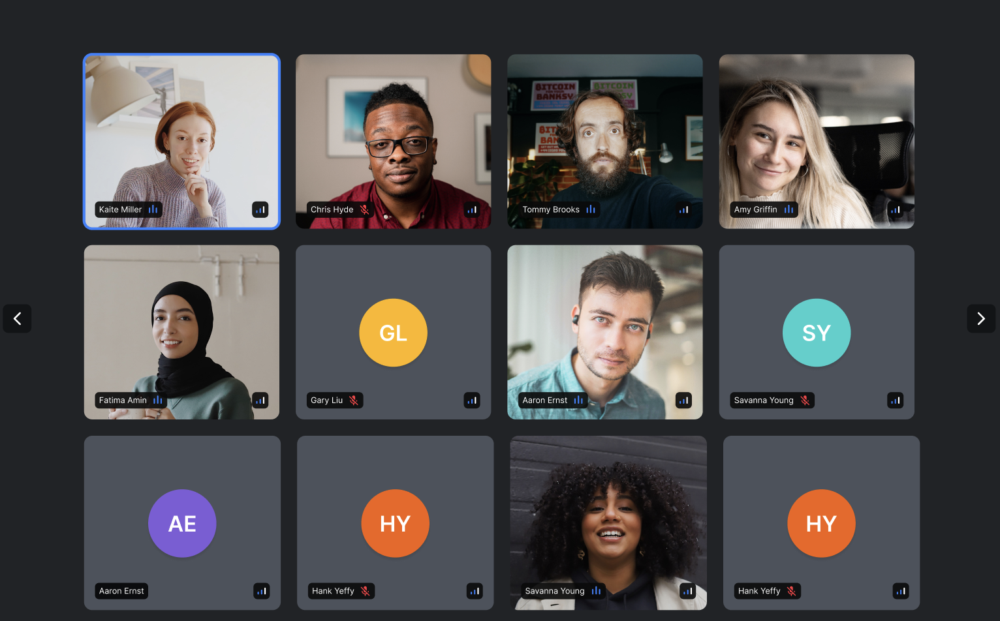

The SDK comes with two built-in call layouts.

The `PaginatedGridLayout` displays [participants](../../../ui-components/core/participant-view) in a grid that is paginated.



The `SpeakerLayout` displays [participants](../../../ui-components/core/participant-view) in a configuration where the dominant speaker/shared screen is in focus and other participants are displayed in a smaller bar.


The `LivestreamLayout` is suitable for livestreaming and displays the dominant speaker/shared screen in a large video.


## General usage

Both layouts gather all necessary [state information via hooks](../../../guides/call-and-participant-state), so you don't need to provide state-related props:

```tsx
import '@stream-io/video-react-sdk/dist/css/styles.css';
import {
  CallControls,
  StreamCall,
  StreamTheme,
  StreamVideo,
  SpeakerLayout,
} from '@stream-io/video-react-sdk';

const MyApp = () => {
  return (
    <StreamVideo client={client}>
      <StreamTheme>
        <StreamCall call={call}>
          //highlight-next-line
          <SpeakerLayout />
          <CallControls />
        </StreamCall>
      </StreamTheme>
    </StreamVideo>
  );
};
```

```tsx
import '@stream-io/video-react-sdk/dist/css/styles.css';
import {
  CallControls,
  StreamCall,
  StreamTheme,
  StreamVideo,
  PaginatedGridLayout,
} from '@stream-io/video-react-sdk';

const MyApp = () => {
  return (
    <StreamVideo client={client}>
      <StreamTheme>
        <StreamCall call={call}>
          //highlight-next-line
          <PaginatedGridLayout />
          <CallControls />
        </StreamCall>
      </StreamTheme>
    </StreamVideo>
  );
};
```

## Built-in Layouts

### `PaginatedGridLayout`

#### Props

| Name                      | Description                                                                                            | Type                                                                                                   |
| ------------------------- | ------------------------------------------------------------------------------------------------------ | ------------------------------------------------------------------------------------------------------ |
| `groupSize`               | The number of participants to display per page                                                         | `number` \| `undefined`                                                                                |
| `excludeLocalParticipant` | Whether to exclude the local participant from the grid                                                 | `boolean` \| `undefined`                                                                               |
| `pageArrowsVisible`       | Turns on/off the pagination arrows                                                                     | `boolean` \| `undefined`                                                                               |
| `ParticipantViewUI`       | [See `ParticipantView` documentation](../../../ui-components/core/participant-view/#participantviewui) | [See `ParticipantView` documentation](../../../ui-components/core/participant-view/#participantviewui) |
| `VideoPlaceholder`        | [See `ParticipantView` documentation](../../../ui-components/core/participant-view/#videoplaceholder)  | [See `ParticipantView` documentation](../../../ui-components/core/participant-view/#videoplaceholder)  |

### `SpeakerLayout`

#### Props

| Name                         | Description                                                                                                                                                | Type                                                                                                   |
| ---------------------------- | ---------------------------------------------------------------------------------------------------------------------------------------------------------- | ------------------------------------------------------------------------------------------------------ |
| `participantsBarPosition`    | The position of the participants who are not in focus, the default is `bottom`. Providing `null` will hide the bar                                         | `top` \| `bottom` \| `left` \| `right` \| `null`                                                       |
| `ParticipantViewUISpotlight` | The participant UI for the spotlight view, [see `ParticipantView` documentation](../../../ui-components/core/participant-view/#participantviewui)          | [See `ParticipantView` documentation](../../../ui-components/core/participant-view/#participantviewui) |
| `ParticipantViewUIBar`       | The participant UI for the participants in the bar, [see `ParticipantView` documentation](../../../ui-components/core/participant-view/#participantviewui) | [See `ParticipantView` documentation](../../../ui-components/core/participant-view/#participantviewui) |
| `VideoPlaceholder`           | [See `ParticipantView` documentation](../../../ui-components/core/participant-view/#videoplaceholder)                                                      | [See `ParticipantView` documentation](../../../ui-components/core/participant-view/#videoplaceholder)  |

### `LivestreamLayout`

#### Props

| Name                                | Description                                             | Type      |
| ----------------------------------- | ------------------------------------------------------- | --------- |
| `muted`                             | Mutes all audio                                         | `boolean` |
| `enableFullscreen`                  | Will render a button to enable fullscreen mode          | `boolean` |
| `showParticipantCount`              | Will show the number of participants                    | `boolean` |
| `showDuration`                      | Will show the duration of the livestream                | `boolean` |
| `showLiveBadge`                     | Will show a badge whether the livestream is live or not | `boolean` |
| `showSpeakerName`                   | Will show the name of the speaker                       | `boolean` |
| `floatingParticipantProps`          | Props to pass to the floating participant view          | `object`  |
| `floatingParticipantProps.position` | Position of the floating participant view               | `string`  |

## Customization

If the [built-in layouts](#built-in-layouts) aren't what you're looking for, it's also possible to create your own layout, see our [Custom Call Layout guide](../../../ui-cookbook/video-layout) for more information.
