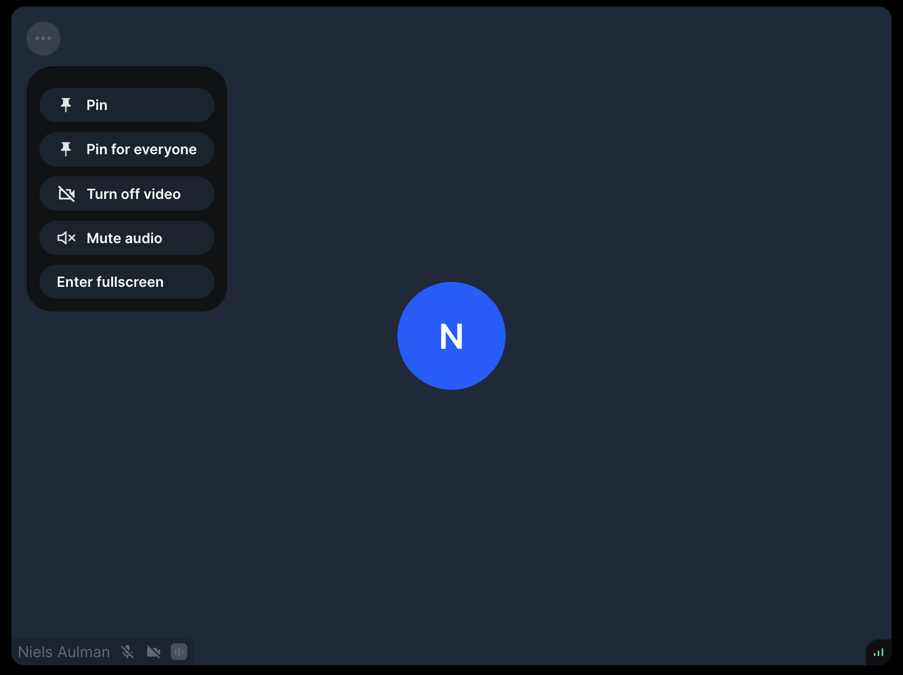

The `ParticipantView` component is a core component that renders a participant's video and plays the participant's audio.

It can toggle between video and avatar based on the participant's video state. It displays information about the participant, their device settings and connection quality. It also provides action buttons (for example, to pin the participant).

To optimize performance,

- the component won't stream video for participants that are not visible in the viewport
- for visible participants it will request the appropriate video track quality and resolution (dynascale)



:::note

Please note that we suggest not to create a custom `ParticipantView` component as it contains complex, low-level logic related to performance. Please refer to the [Customization section](#customization) to see how you can tailor the component to your needs.

:::

## General usage

You can use the `ParticipantView` component to create your own call layout:

```tsx
import '@stream-io/video-react-sdk/dist/css/styles.css';
import {
  CallControls,
  ParticipantView,
  StreamCall,
  useParticipants,
} from '@stream-io/video-react-sdk';

const CallUI = () => {
  const participants = useParticipants();

  return (
    <StreamCall
      callType="default"
      callId="my-first-call"
      data={{ create: true }}
      autoJoin
    >
      {participants.map((p) => (
        // highlight-next-line
        <ParticipantView participant={p} />
      ))}
      <CallControls />
    </StreamCall>
  );
};
```

## Props

### `participant`

| Type                                                                                                            |
| --------------------------------------------------------------------------------------------------------------- |
| [`StreamVideoParticipant`](https://github.com/GetStream/stream-video-js/blob/main/packages/client/src/types.ts) |

The participant whose video/audio feed we want to show.

### `ParticipantViewUI`

| Type                                        |
| ------------------------------------------- |
| `ComponentType` \| `ReactElement` \| `null` |

Override the default UI for rendering participant information/actions.

### `VideoPlaceholder`

| Type                                        |
| ------------------------------------------- |
| `ComponentType` \| `ReactElement` \| `null` |

Override the default UI that's visible when a participant turned off their video.

### `sinkId`

| Type                    |
| ----------------------- |
| `string` \| `undefined` |

In [supported browsers](https://developer.mozilla.org/en-US/docs/Web/API/HTMLMediaElement/sinkId), this sets the default audio output.
The value of this prop should be a valid audio output device ID.
You can set this using `audioOutputDeviceId` field of the [local participant](../../../call-engine/hooks-and-contexts/#uselocalparticipant).

### `videoKind`

| Type                |
| ------------------- |
| `video` \| `screen` |

The kind of video stream to play for the given participant.

### `muteAudio`

| Type      |
| --------- |
| `boolean` |

You can mute the audio of the given participant (this is a local action, it won't have any effect on the published audio of the participant). The `ParticipantView` will mute the audio of the local participant by default.

### `className`

| Type                    |
| ----------------------- |
| `string` \| `undefined` |

Custom class applied to the root DOM element.

### `refs`

| Type                                                                               |
| ---------------------------------------------------------------------------------- |
| `{setVideoElement: Function, setVideoPlaceholderElement: Function}` \| `undefined` |

An object with set functions meant for exposing the video and video placeholder elements to the integrators.

## Customization

The [ParticipantView customizations guide](../../../ui-cookbook/participant-view-customizations) tells all the important informiation about the customization options.

We also have additional guides focusing on specific parts:

- [Video placeholder](../../../ui-cookbook/video-placeholder)
- [Connection Quality Indicator](../../../ui-cookbook/connection-quality-indicator)
- [Custom Label](../../../ui-cookbook/custom-label)
