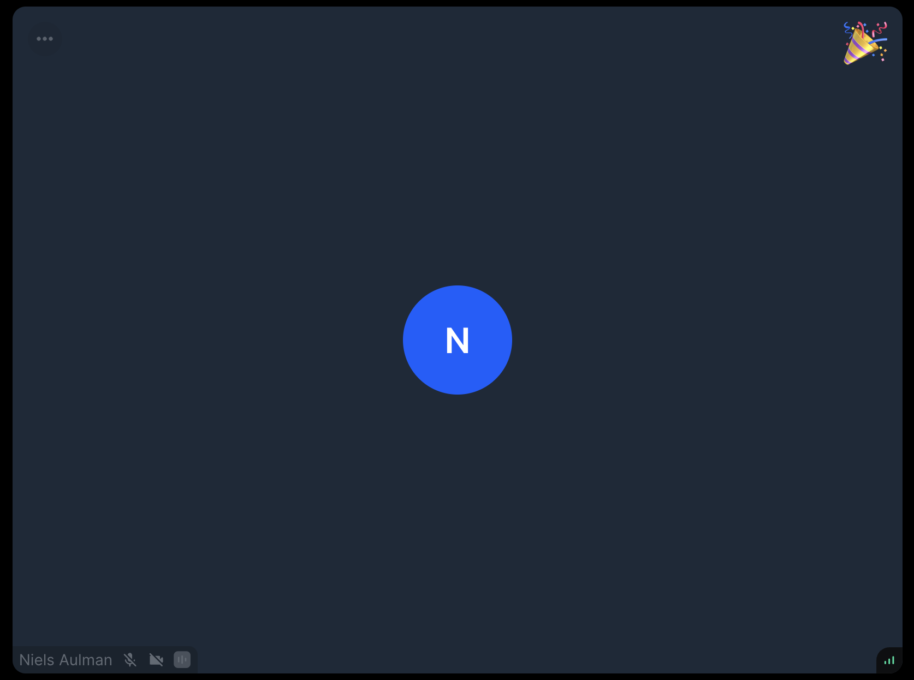

Reaction component is used to display emojis in real-time for a specified amount of time. You can utilise this functionality to notify other participants that you want to speak by "raising hand". Our default sorting algorithm will push participants with raised hand to the top of the list for better visibility. Learn more about reaction events and their customization in the [Reactions & Custom Events guide](../../../guides/reactions-and-custom-events) and see how sorting works in the [Participant sorting guide](../../../guides/sorting-api).



## General usage

Our `DefaultParticipantViewUI` already comes with the `Reaction` component built in but if you're building your custom `ParticipantViewUI` here's how you'd incorporate the `Reaction` component into your UI:

```tsx
import {
  Reaction,
  useParticipantViewContext,
} from '@stream-io/video-react-sdk';

export const CustomParticipantViewUI = () => {
  const { participant } = useParticipantViewContext();
  return (
    <>
      <Reaction participant={participant} hideAfterTimeoutInMs={5000} />
    </>
  );
};
```

## Final steps

Now we can pass this custom `ParticipantViewUI` component down to our call layout components or directly to `ParticipantView` component in our custom call layout as described in the [participant view customizations guide](../../../ui-cookbook/participant-view-customizations).

## Props

### `participant`

| Type                                                                                                            |
| --------------------------------------------------------------------------------------------------------------- |
| [`StreamVideoParticipant`](https://github.com/GetStream/stream-video-js/blob/main/packages/client/src/types.ts) |

The participant whose reaction the component should display.

### `hideAfterTimeoutInMs`

| Type                    |
| ----------------------- |
| `number` \| `undefined` |

Timeout in miliseconds after which the component resets [participant reaction state](../../../guides/reactions-and-custom-events/#clearing-reactions).
