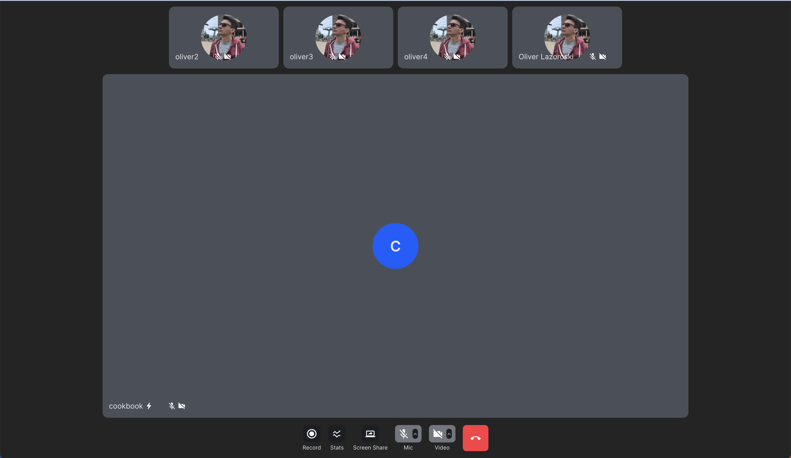

## Introduction

The purpose of this guide is to help developers understand how to build a custom call layout
using Stream React Video SDK. The guide will cover the necessary steps:

1. connecting to Stream's edge infrastructure
2. joining a call
3. building the layout

## About the sample application

To demonstrate the flexibility of our React Video SDK, we are going to build a custom layout that looks similar to
Zoom's Speaker View layout. We will be using Vite + TS SPA template.
The code for the app can be found [here](https://github.com/GetStream/stream-video-js/tree/main/sample-apps/react/cookbook-participant-list).

This application allows a user to join a call by providing the call ID and type.
Once having joined a call, the user will be able to mute/unmute their audio and video and
display the video streams of all participants in a "Zoom Speaker View"-like layout.

The final layout looks like this:



## Prerequisites

Before we can join a call, we need to connect to Stream's edge infrastructure.
To do that, we follow these steps:

- [Register for a Stream account](https://getstream.io/try-for-free/) and obtain our API key and secret.
- Install the Stream React Video SDK:
- `npm install @stream-io/video-react-sdk`
- `yarn add @stream-io/video-react-sdk`
- [Initialize the SDK](../../guides/client-auth) by passing in your API key, token and user information
- [Create and join a call](../../guides/joining-and-creating-calls)

## Building and rendering the layout

Now that we have successfully set up the React Video SDK and joined the call, we can start building our custom layout.
For that purpose, we are going to utilize some fundamental React Video SDK components and hooks.

- [`<ParticipantView />`](../../ui-components/core/participant-view) - A component that renders a video stream of a participant.
- [`useCall()`](../04-call-engine/hooks-and-contexts.md#usecall) - A hook that returns the current call instance. You can use this hook to access the call state and call methods.
- [`useParticipants()`](../04-call-engine/hooks-and-contexts.md#useparticipants) - A hook that returns the list of all participants in the call.

```tsx
// will load the default styling for the React Video SDK
import '@stream-io/video-styling/dist/css/styles.css';
import './SpeakerView.scss';

import {
  StreamTheme,
  ParticipantView,
  useCall,
  useParticipants,
} from '@stream-io/video-react-sdk';
```

```tsx
export const SpeakerView = () => {
  const call = useCall();
  const [participantInSpotlight, ...otherParticipants] = useParticipants();

  return (
    // enables the default styling for the video SDK
    <div className="speaker-view">
      {call && otherParticipants.length > 0 && (
        <div className="participants-bar">
          {otherParticipants.map((participant) => (
            <div className="participant-tile" key={participant.sessionId}>
              <ParticipantView participant={participant} />
            </div>
          ))}
        </div>
      )}

      <div className="spotlight">
        {call && participantInSpotlight && (
          <ParticipantView
            participant={participantInSpotlight}
            videoKind={
              hasScreenShare(participantInSpotlight) ? 'screen' : 'video'
            }
          />
        )}
      </div>
    </div>
  );
};

// utility to determine whether the participant in spotlight is sharing their screen
const hasScreenShare = (p: StreamVideoParticipant) =>
  p.publishedTracks.includes(SfuModels.TrackType.SCREEN_SHARE);
```

### Sorting the participants

The React SDK comes with some default sorting logic for the participants in the call.

:::info
You can read more about this in the [Sorting API](../../guides/sorting-api).
:::

The Participant Sorting API is customizable and allows us to define our custom sorting logic in case the default
one doesn't fit your use case.

In this example, let's assume that we want to have a custom sorting logic for the participants in the call
that would follow the following rules:

1. In 1:1 calls, the remote participant will be displayed in the largest space in the layout.
2. In group calls, we want this custom participant sorting:

- Presenter will be displayed first
- Dominant speaker will be displayed next
- Pinned participants will be displayed after, as we want them to be pinned at the beginning of the participant list
- The rest of the participants will be sorted at the top of the screen according to the following criteria:
- Participants who are speaking or have their hand raised
- Participants with audio and video will be displayed next
- Followed by video-only participants
- Followed by audio-only participants
- Muted participants will be displayed last

### Configure the sorting logic

Having the rules set, let's go and configure the sorting function:

```tsx
const getCustomSortingPreset = (
  isOneToOneCall: boolean = false,
): Comparator<StreamVideoParticipant> => {
  // 1:1 calls are a special case, where we want to always show the other
  // participant in the spotlight, and not show them in the participants bar.
  if (isOneToOneCall) {
    return (a: StreamVideoParticipant, b: StreamVideoParticipant) => {
      if (a.isLoggedInUser) return 1;
      if (b.isLoggedInUser) return -1;
      return 0;
    };
  }

  // a comparator decorator which applies the decorated comparator only if the
  // participant is invisible.
  // This ensures stable sorting when all participants are visible.
  const ifInvisibleBy = conditional(
    (a: StreamVideoParticipant, b: StreamVideoParticipant) =>
      a.viewportVisibilityState === VisibilityState.INVISIBLE ||
      b.viewportVisibilityState === VisibilityState.INVISIBLE,
  );

  // the custom sorting preset
  return combineComparators(
    screenSharing,
    dominantSpeaker,
    pinned,
    ifInvisibleBy(speaking),
    ifInvisibleBy(reactionType('raised-hand')),
    ifInvisibleBy(publishingVideo),
    ifInvisibleBy(publishingAudio),
  );
};
```

### Apply sorting to the call

Now that we have the sorting function, let's go ahead and apply it to the call.
We can do that by calling the [`Call.setSortParticipantsBy()`](../04-call-engine/Call.md#setsortparticipantsby) method
in a `useEffect` hook (see full code [here](https://github.com/GetStream/stream-video-js/blob/main/sample-apps/react/cookbook-participant-list/src/SpeakerView.tsx)):

```tsx
export const SpeakerView = () => {
  const call = useCall();
  const [participantInSpotlight, ...otherParticipants] = useParticipants();

  // highlight-start
  // determine whether the call is a 1:1 call
  const isOneToOneCall = otherParticipants.length === 1;
  useEffect(() => {
    if (!call) return;
    const customSortingPreset = getCustomSortingPreset(isOneToOneCall);
    call.setSortParticipantsBy(customSortingPreset);
  }, [call, isOneToOneCall]);
  // highlight-end

  return (
    <div className="speaker-view">
      {call && otherParticipants.length > 0 && (
        <div className="participants-bar">
          {otherParticipants.map((participant) => (
            <div className="participant-tile" key={participant.sessionId}>
              <ParticipantView participant={participant} />
            </div>
          ))}
        </div>
      )}

      <div className="spotlight">
        {call && participantInSpotlight && (
          <ParticipantView
            participant={participantInSpotlight}
            videoKind={
              hasScreenShare(participantInSpotlight) ? 'screen' : 'video'
            }
          />
        )}
      </div>
    </div>
  );
};

// utility to determine whether the participant in spotlight is sharing their screen
const hasScreenShare = (p: StreamVideoParticipant) =>
  p.publishedTracks.includes(SfuModels.TrackType.SCREEN_SHARE);

// the sorting code goes here
```

### Bandwidth and CPU optimizations with `ViewportTracker`

In calls with a large number of participants, your horizontal list will grow past viewable boundaries. Each of these `ParticipantView` components will keep subscribing to the video stream and will keep playing it even if they're not visible to the user which is wasteful because of heavy CPU and bandwidth usage. To mitigate this issue each `Call` instance contains one `ViewportTracker` instance (`call.viewportTracker`) with `observe` and `setViewport` methods. The `ParticipantView` component already utilizes this functionality under the hood (`observe`) so all we need to do is to call `setViewport` with your horizontal list element as an argument and we're set.

```tsx
export const SpeakerView = () => {
  const call = useCall();
  const [participantInSpotlight, ...otherParticipants] = useParticipants();
  // highlight-start
  const [participantsBar, setParticipantsBar] = useState<HTMLDivElement | null>(
    null,
  );
  // highlight-end

  // determine whether the call is a 1:1 call
  const isOneToOneCall = otherParticipants.length === 1;
  useEffect(() => {
    if (!call) return;
    const customSortingPreset = getCustomSortingPreset(isOneToOneCall);
    call.setSortParticipantsBy(customSortingPreset);
  }, [call, isOneToOneCall]);

  // highlight-start
  useEffect(() => {
    if (!participantsBar || !call) return;

    const cleanup = call.viewportTracker.setViewport(participantsBar);

    return () => cleanup();
  }, [participantsBar, call]);
  // highlight-end

  return (
    <div className="speaker-view">
      {call && otherParticipants.length > 0 && (
        // highlight-next-line
        <div ref={setParticipantsBar} className="participants-bar">
          {otherParticipants.map((participant) => (
            <div className="participant-tile" key={participant.sessionId}>
              <ParticipantView participant={participant} />
            </div>
          ))}
        </div>
      )}

      <div className="spotlight">
        {call && participantInSpotlight && (
          <ParticipantView
            participant={participantInSpotlight}
            videoKind={
              hasScreenShare(participantInSpotlight) ? 'screen' : 'video'
            }
          />
        )}
      </div>
    </div>
  );
};

// utility to determine whether the participant in spotlight is sharing their screen
const hasScreenShare = (p: StreamVideoParticipant) =>
  p.publishedTracks.includes(SfuModels.TrackType.SCREEN_SHARE);
```

Now these changes will ensure that we only subscribe to the video streams users actually see on their screens.

### Final steps

Let's add one last component which is just a custom combination of call control buttons and finalize our application by composing the components we just created:

```tsx
import {
  SpeakingWhileMutedNotification,
  ToggleAudioPublishingButton,
  ToggleVideoPublishingButton,
  CancelCallButton,
  ScreenShareButton,
  StreamTheme,
} from '@stream-io/video-react-sdk';

const CustomCallControls = () => {
  const call = useCall();

  return (
    <div className="str-video__call-controls">
      <ScreenShareButton />
      <SpeakingWhileMutedNotification>
        <ToggleAudioPublishingButton />
      </SpeakingWhileMutedNotification>
      <ToggleVideoPublishingButton />
      <CancelCallButton
        onLeave={() => {
          console.log('onLeave callback called');
        }}
      />
    </div>
  );
};

export const App = () => {
  return (
    // enables the default styling for the video SDK
    <StreamTheme>
      <SpeakerView />
      <CustomCallControls />
    </StreamTheme>
  );
};
```

And that's it. We have successfully built our custom layout. At last, you can find the running example of this guide [here](https://github.com/GetStream/stream-video-js/sample-apps/react/cookbook-participant-list).

:::note
The tutorial does not include the styling of the component, but you can find the full code in the [SpeakerView.scss](https://github.com/GetStream/stream-video-js/blob/main/sample-apps/react/cookbook-participant-list/src/SpeakerView.scss) file.
:::

## Further customization

The React Video SDK is built on top of the data model that our [call engine](../../call-engine/01-call-engine-overview) exposes.
As such, you can use the same data model to build your own custom layouts.
You can go further and build your own custom components, but we advise you to use some of our core components (e.g. `ParticipantView`) and hooks to make sure that you wouldn't have to re-implement some baked-in functionality like:

- Simulcast,
- DynaScale,
- Track Subscription handling,
- muting/unmuting, etc.

Thanks for following this guide and always feel free to reach out to us at the bottom of this page or let us know
when you build up something cool with our SDK on [Twitter](https://twitter.com/getstream_io).
