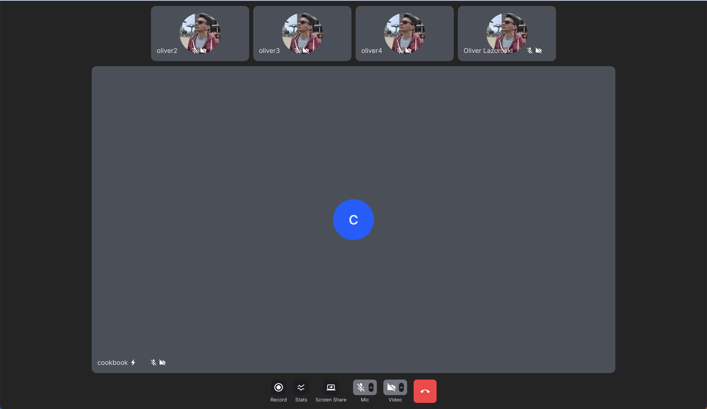

## Introduction

The purpose of this guide is to help developers understand how to build a custom call participant list layout
using Stream React Video SDK. The guide will cover the necessary steps to connect to Stream's edge infrastructure,
join a call, and build the layout.

## About the sample application

To demonstrate the flexibility of our React Video SDK, we are going to build a custom layout that looks similar to
Zoom's Speaker View layout. We will be using Vite + TS SPA template.
The code for the app can be found [here](https://github.com/GetStream/stream-video-js/tree/main/sample-apps/react/cookbook-participant-list).

This application allows a user to join a call by providing the call ID and type.
Once having joined a call, the user will be able to mute/unmute their audio and video and
display the video streams of all participants in a "Zoom Speaker View"-like layout.

The final layout looks like this:



## Prerequisites

Before we can join a call, we need to connect to Stream's edge infrastructure.
To do that, we follow these steps:

- Register for a Stream account and obtain our API key and secret.
- Install the Stream React Video SDK:
  - `npm install @stream-io/video-react-sdk`
  - `yarn add @stream-io/video-react-sdk`
- Initialize the SDK by passing in your API key, token and user information:

:::note
For the token generation, you can use our [Token Generator](https://getstream.io/chat/docs/token_generator/).
:::

```tsx
import {
  StreamVideo,
  useCreateStreamVideoClient,
} from '@stream-io/video-react-sdk';

// This is the component that will render the custom layout.
// We can assume that the implementation of this component is empty for now.
import { SpeakerView } from './SpeakerView';

// We are going to use Vite's environment variables to store our API key and token.
// https://vitejs.dev/guide/env-and-mode.html#env-files
//
// You can use any other method to store your API key and token.
const apiKey = import.meta.env.VITE_STREAM_API_KEY as string;
const token = import.meta.env.VITE_STREAM_TOKEN as string;
const userId = import.meta.env.VITE_USER_ID as string;

export const App = () => {
  const client = useCreateStreamVideoClient({
    apiKey,
    tokenOrProvider: token,
    user: {
      id: userId,
    },
  });

  return (
    <StreamVideo client={client}>
      <SpeakerView />
    </StreamVideo>
  );
};
```

## Joining a Call

To join a call, we need to know its ID and type. The call ID and type can come from any source we like such as an API or user input.
In our example, we are going to get the call ID and type from the URL query parameters.

Once we have that information, we can join the call by choosing one of the two options:

1. Declarative, using the [`<StreamMeeting />`](../03-ui/components.md#streammeeting) component.
2. Imperative, using the [`StreamVideoClient`](../04-call-engine/StreamVideoClient.md) API methods (advanced usage).

In our example, we are going to use the declarative approach because it is easier to understand and
has less code (see full example [here](https://github.com/GetStream/stream-video-js/blob/main/sample-apps/react/cookbook-participant-list/src/App.tsx)):

```tsx
/* Imports and previous setup. */
const randomId = () => Math.random().toString(36).substring(2, 12);

export const App = () => {
  const client = useCreateStreamVideoClient({
    apiKey,
    tokenOrProvider: token,
    user: {
      id: userId,
    },
  });

  // will load the call ID from the URL query params,
  // or generate a random one in case it is not present.
  const [callId, setCallId] = useState(() => {
    const params = new URLSearchParams(
      window.location.search || window.location.hash,
    );

    return params.get('call_id') || randomId();
  });

  return (
    <StreamVideo client={client}>
      <StreamMeeting
        callId={callId}
        callType="default"
        input={{ create: true }}
      >
        <SpeakerView />
      </StreamMeeting>
    </StreamVideo>
  );
};
```

Behind the scenes, the `<StreamMeeting />` component will set up and join a new [Call](../04-call-engine/Call.md) instance,
and will expose the [CallState](../04-call-engine/hooks-and-contexts.md/#streamcallprovider) object down in the component tree through a [React Context](https://react.dev/learn/passing-data-deeply-with-context).

You can read more about this mechanism as part of our [React Bindings and Hooks documentation](../04-call-engine/01-overview.gen.mdx).

## Building and rendering the Layout

Now that we have successfully set up the React Video SDK and joined the call, we can start building our custom layout.
For that purpose, we are going to utilize some fundamental React Video SDK components and hooks.

- [`<ParticipantBox />`](../03-ui/components.md#participantbox) - A component that renders a video stream of a participant.
- [`useCall()`](../04-call-engine/hooks-and-contexts.md#usecall) - A hook that returns the current call instance. You can use this hook to access the call state and call methods.
- [`useParticipants()`](../04-call-engine/hooks-and-contexts.md#useparticipants) - A hook that returns the list of all participants in the call.

```tsx
// will load the default styling for the React Video SDK
import '@stream-io/video-styling/dist/css/styles.css';
import './SpeakerView.scss';

export const SpeakerView = () => {
  const call = useCall();
  const [participantInSpotlight, ...otherParticipants] = useParticipants();
  return (
    // "str-video" enables the default styling for the video SDK
    <div className="str-video speaker-view">
      {call && otherParticipants.length > 0 && (
        <div className="participants-bar">
          {otherParticipants.map((participant) => (
            <div className="participant-tile" key={participant.sessionId}>
              <ParticipantBox participant={participant} call={call} />
            </div>
          ))}
        </div>
      )}

      <div className="spotlight">
        {call && participantInSpotlight && (
          <ParticipantBox
            participant={participantInSpotlight}
            call={call}
            videoKind={
              hasScreenShare(participantInSpotlight) ? 'screen' : 'video'
            }
          />
        )}
      </div>

      <CustomCallControls>
        {call && <ScreenShareButton call={call} />}
        <SpeakingWhileMutedNotification>
          <ToggleAudioPublishingButton />
        </SpeakingWhileMutedNotification>
        <ToggleCameraPublishingButton />
        {call && (
          <CancelCallButton
            call={call}
            onLeave={() => {
              console.log('onLeave callback called');
            }}
          />
        )}
      </CustomCallControls>
    </div>
  );
};

const CustomCallControls = ({ children }: PropsWithChildren<{}>) => {
  return <div className="str-video__call-controls">{children}</div>;
};

const hasScreenShare = (p: StreamVideoParticipant) =>
  p.publishedTracks.includes(SfuModels.TrackType.SCREEN_SHARE);
```

### Sorting the participants

The React SDK comes with some default sorting logic for the participants in the call.

:::info
You can read more about this in the [Sorting API](//TODO).
:::

The Participant Sorting API is customizable and allows us to define our custom sorting logic in case the default
one doesn't fit your use case.

In this example, let's assume that we want to have a custom sorting logic for the participants in the call
that would follow the following rules:

1. In 1:1 calls, the remote participant will be displayed in the largest space in the layout.
2. In group calls, we want this custom participant sorting:

- Presenter will be displayed first
- Dominant speaker will be displayed next
- Pinned participants will be displayed after, as we want them to be pinned at the beginning of the participant list
- The rest of the participants will be sorted at the top of the screen according to the following criteria:
  - Participants who are speaking or have their hand raised
  - Participants with audio and video will be displayed next
  - Followed by video-only participants
  - Followed by audio-only participants
  - Muted participants will be displayed last

### Configure the sorting logic

Having the rules set, let's go and configure the sorting function:

```tsx
const getCustomSortingPreset = (
  isOneToOneCall: boolean = false,
): Comparator<StreamVideoParticipant> => {
  // 1:1 calls are a special case, where we want to always show the other
  // participant in the spotlight, and not show them in the participants bar.
  if (isOneToOneCall) {
    return (a: StreamVideoParticipant, b: StreamVideoParticipant) => {
      if (a.isLoggedInUser) return 1;
      if (b.isLoggedInUser) return -1;
      return 0;
    };
  }

  // a comparator decorator which applies the decorated comparator only if the
  // participant is invisible.
  // This ensures stable sorting when all participants are visible.
  const ifInvisibleBy = conditional(
    (a: StreamVideoParticipant, b: StreamVideoParticipant) =>
      a.viewportVisibilityState === VisibilityState.INVISIBLE ||
      b.viewportVisibilityState === VisibilityState.INVISIBLE,
  );

  // the custom sorting preset
  return combineComparators(
    screenSharing,
    dominantSpeaker,
    pinned,
    ifInvisibleBy(speaking),
    ifInvisibleBy(reactionType('raised-hand')),
    ifInvisibleBy(publishingVideo),
    ifInvisibleBy(publishingAudio),
  );
};
```

### Apply sorting to the call

Now that we have the sorting function, let's go ahead and apply it to the call.
We can do that by calling the [`Call.setSortParticipantsBy()`](../04-call-engine/Call.md#setsortparticipantsby) method
in a `useEffect` hook (see full code [here](https://github.com/GetStream/stream-video-js/blob/main/sample-apps/react/cookbook-participant-list/src/SpeakerView.tsx)):

```tsx
import './SpeakerView.scss';

export const SpeakerView = () => {
  const call = useCall();
  const [participantInSpotlight, ...otherParticipants] = useParticipants();

  // determine whether the call is a 1:1 call
  const isOneToOneCall = otherParticipants.length === 1;
  // highlight-start
  useEffect(() => {
    if (!call) return;
    const customSortingPreset = getCustomSortingPreset(isOneToOneCall);
    call.setSortParticipantsBy(customSortingPreset);
  }, [call, isOneToOneCall]);
  // highlight-end

  return (
    <div className="speaker-view">
      {call && otherParticipants.length > 0 && (
        <div className="participants-bar">
          {otherParticipants.map((participant) => (
            <div className="participant-tile" key={participant.sessionId}>
              <ParticipantBox participant={participant} call={call} />
            </div>
          ))}
        </div>
      )}

      <div className="spotlight">
        {call && participantInSpotlight && (
          <ParticipantBox
            participant={participantInSpotlight}
            call={call}
            videoKind={
              hasScreenShare(participantInSpotlight) ? 'screen' : 'video'
            }
          />
        )}
      </div>

      <CustomCallControls>
        {call && <ScreenShareButton call={call} />}
        <SpeakingWhileMutedNotification>
          <ToggleAudioPublishingButton />
        </SpeakingWhileMutedNotification>
        <ToggleCameraPublishingButton />
        {call && (
          <CancelCallButton
            call={call}
            onLeave={() => {
              console.log('onLeave callback called');
            }}
          />
        )}
      </CustomCallControls>
    </div>
  );
};

const CustomCallControls = ({ children }: PropsWithChildren<{}>) => {
  return <div className="str-video__call-controls">{children}</div>;
};

const hasScreenShare = (p: StreamVideoParticipant) =>
  p.publishedTracks.includes(SfuModels.TrackType.SCREEN_SHARE);

// The sorting code goes here.
```

We won't be covering the styling in this tutorial, but you can find the full code in the [SpeakerView.scss](https://github.com/GetStream/stream-video-js/blob/main/sample-apps/react/cookbook-participant-list/src/SpeakerView.scss) file.

And that's it. We have successfully built our custom layout.
At last, you can find the running example of this guide [here](https://github.com/GetStream/stream-video-js/sample-apps/react/cookbook-participant-list).

## Further customization

The React Video SDK is built on top of the data model that our [call engine](../04-call-engine/01-overview.gen.mdx) exposes.
As such, you can use the same data model to build your own custom layouts.
You can go further and build your own custom components, but we advise you to at least use some of our base components and hooks
to make sure that you wouldn't have to re-implement some baked-in functionality like:

- Simulcast,
- DynaScale,
- Track Subscription handling,
- muting/unmuting, etc.

Thanks for following this guide and always feel free to reach out to us at the bottom of this page or let us know
when you build up something cool with our SDK on [Twitter](https://twitter.com/getstream_io).
