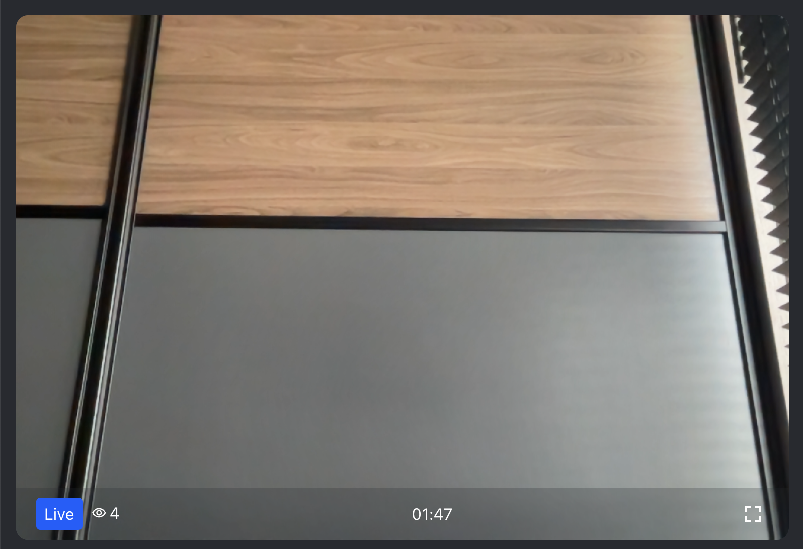
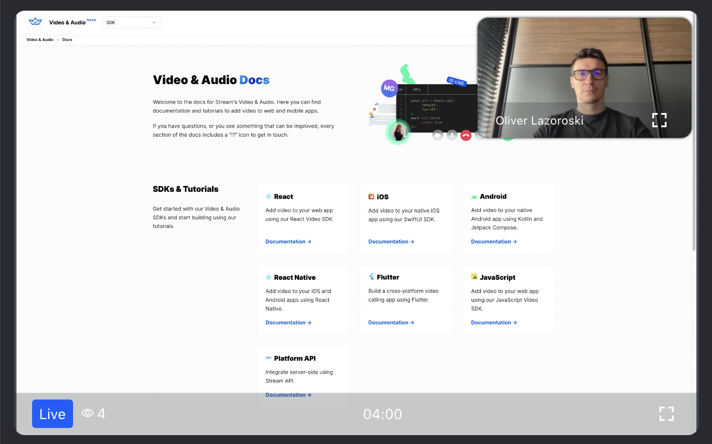

As already described in our [livestream tutorial](https://getstream.io/video/sdk/react/tutorial/livestreaming/),
there are two ways how a livestream can be watched: either via HLS or via WebRTC.

This guide describes how to watch a livestream via WebRTC.

Our React Video SDK provides a specialized `LivestreamLayout` component for this purpose.
Right next to playing the livestream, it also provides a standardized livestreaming experience:

- Shows a "Live" indicator badge
- Shows the current viewer count
- Shows the duration of the livestream
- Allows toggling between fullscreen and normal mode

Here is a preview of the `LivestreamLayout` component in video mode:


And, in screen share mode:


## Usage

```tsx
import {
  LivestreamLayout,
  StreamVideo,
  StreamCall,
} from '@stream-io/video-react-sdk';

export const MyLivestreamApp = () => {
  // init client and call here...
  return (
    <StreamVideo client={client}>
      <StreamCall call={call}>
        <LivestreamLayout
          muted={false}
          enableFullscreen={true}
          showParticipantCount={true}
          showDuration={true}
          showLiveBadge={true}
          showSpeakerName={false}
          floatingParticipantProps={{
            muted: false,
            enableFullscreen: true,
            showParticipantCount: true,
            showDuration: true,
            showLiveBadge: true,
            showSpeakerName: false,
            position: 'top-right',
          }}
        />
      </StreamCall>
    </StreamVideo>
  );
};
```

Note: Please make sure that the livestream is started and the call isn't in `backstage` mode before rendering this component.

### Customization options

The `LivestreamLayout` component provides a few customization options that can be passed as props:

- `muted` - a `boolean` flag that indicates whether the livestream should be muted or not. Defaults to `false`.
- `enableFullscreen` - a `boolean` flag that indicates whether the fullscreen button should be shown or not. Defaults to `true`.
- `showParticipantCount`- a `boolean` flag that indicates whether the current viewer count should be shown or not. Defaults to `true`.
- `showDuration` - a `boolean` flag that indicates whether the duration of the livestream should be shown or not. Defaults to `true`.
- `showLiveBadge`- a `boolean` flag that indicates whether the "Live" badge should be shown or not. Defaults to `true`.
- `showSpeakerName` - a `boolean` flag that indicates whether the speaker should be shown or not. Defaults to `false`.
- `floatingParticipantProps` - an optional object that contains props that should be passed to the "Floating Participant" component in screen-share mode.
  They are identical to the props of the `LivestreamLayout` component props.
- `floatingParticipantProps.position` - a `string` that indicates the position of the "Floating Participant" component.
  Can be either `top-left`, `top-right`, `bottom-left` or `bottom-right`. Defaults to `top-right`.
