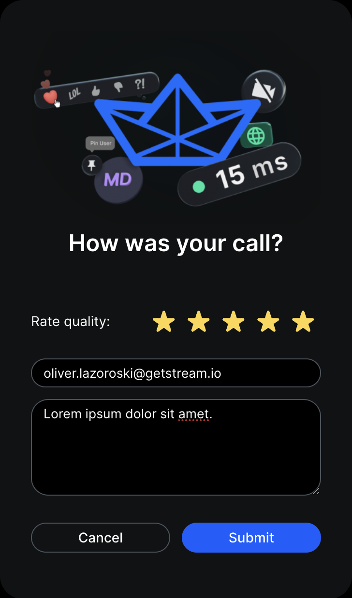

## Introduction

In this guide, we are going to show how one can build a call quality rating form on top of our React Video SDK.
It is a good practice to ask your end users about their overall experience after the end of the call or, while being in a call.

Here is a preview of the component we are going to build:


## SendFeedback API

Our React Video SDK provides an API for collecting this feedback which later can be seen in the call stats section of our dashboard.

```ts
await call.submitFeedback(
  rating, // a rating grade from 1 - 5,
  {
    reason, // the main feedback
    custom: {
      // ... any extra properties that you wish to collect
    },
  },
);
```

## Implementation

```tsx
import clsx from 'clsx';
import { useCallback, useState } from 'react';
import { useCall, Icon } from '@stream-io/video-react-sdk';

export const MyFeedbackForm = () => {
  const call = useCall();
  const [rating, setRating] = useState<number>(0);
  const [email, setEmail] = useState<string>();
  const [message, setMessage] = useState<string>();

  const handleSubmitFeedback = useCallback(() => {
    call?.submitFeedback(Math.min(Math.max(1, rating), 5), {
      reason: message,
      custom: {
        email,
      },
    });
  }, [call, email, message, rating]);

  return (
    <div className="my-feedback-form">
      
      <h2>How was your call?</h2>

      <div className="rating">
        <span>Rate quality:</span>
        {[...new Array(5)].map((_, index) => {
          const active = index + 1 <= rating;
          return (
            <div key={index} onClick={() => setRating(index + 1)}>
              <Icon
                icon="star"
                className={clsx('rating-star', active && 'rating-star--active')}
              />
            </div>
          );
        })}
      </div>
      <input
        type="text"
        placeholder="E-Mail"
        value={email}
        onChange={(e) => setEmail(e.target.value)}
      />
      <input
        type="text"
        placeholder="Message"
        value={message}
        onChange={(e) => setMessage(e.target.value)}
      />

      <button type="button" onClick={handleSubmitFeedback}>
        Submit
      </button>
    </div>
  );
};
```
