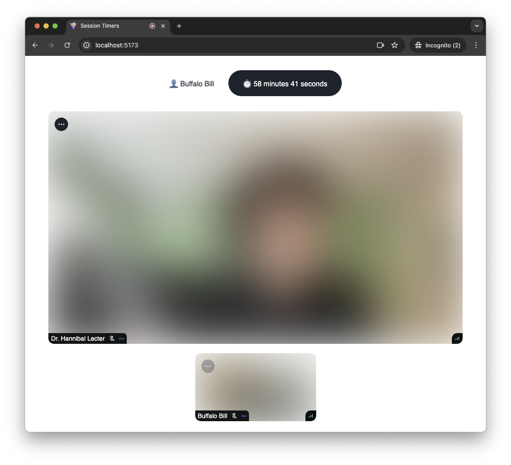
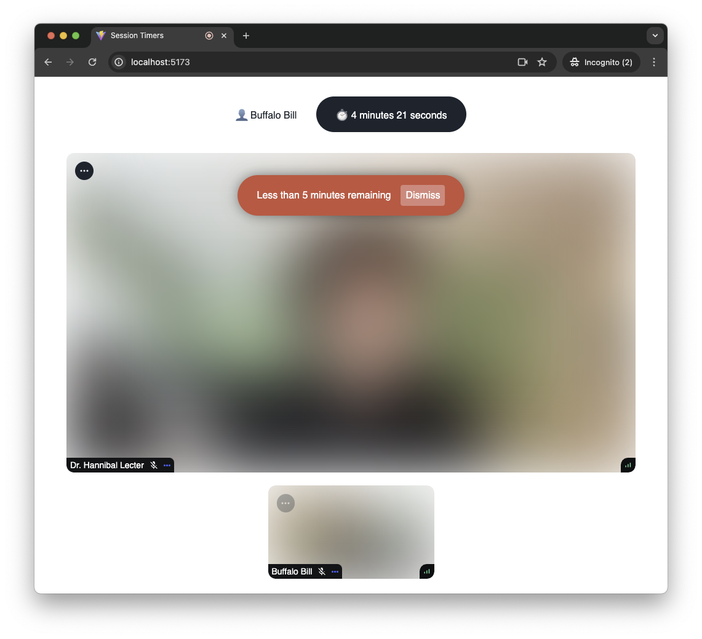
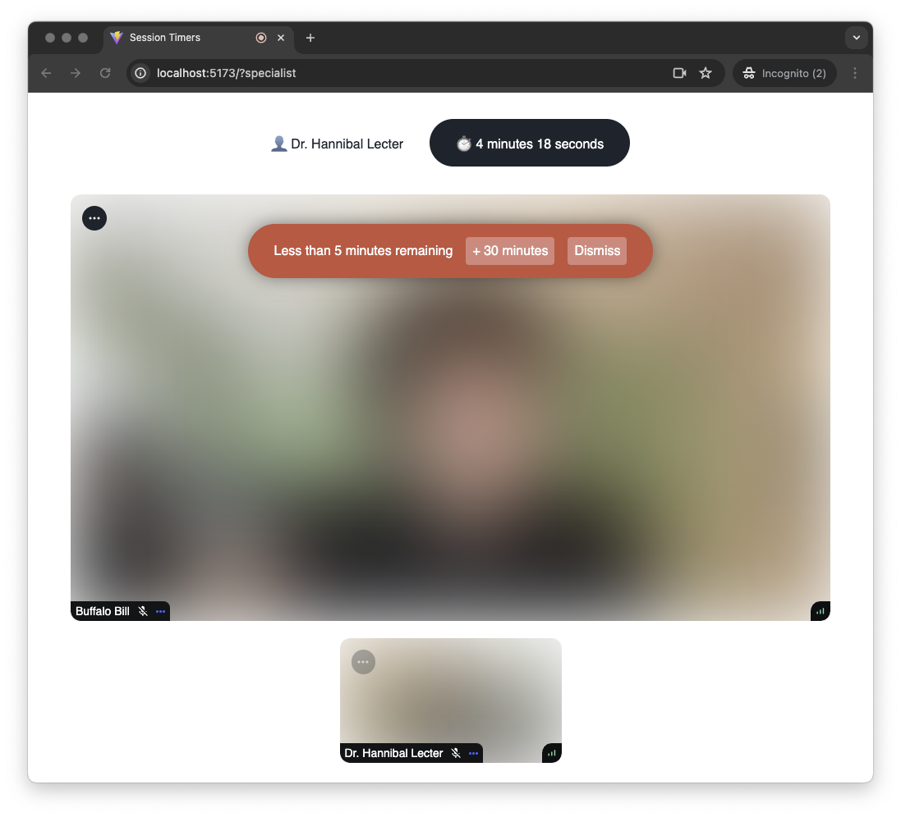

A session timer allows you to limit the maximum duration of a call. It's
possible to
[configure a session timer](https://getstream.io/video/docs/api/calls/#session-timers)
for a single call, or for every call of a certain type. When a session timer
reaches zero, the call automatically ends, making it a great tool for managing
paid appointments.

In this article we'll integrate a session timer into a sample telemedicine
application. We assume that two users are joining a call: a medical specialist,
and a patient. Each appointment lasts 30 minutes, but the specialist can extend
an appointment if necessary.

## Prerequisites

Let's start by setting up an application. Here's what we need:

1. Separate user roles for a medical specialist (`specialist`) and a patient
   (`patient`)
2. An `appointment` call type with a maximum duration of 30 minutes
3. Two test users, one for each call (we'll call them `dr-lecter` and `bill`)
4. One test call of an `appointment` type

The quickest way to set up these requirements is to use the server-side Node.js
SDK. So let's install it:

```sh
npm install @stream-io/node-sdk
# or using yarn:
yarn add @stream-io/node-sdk
```

And then run a one-off script:

```js
import { StreamClient, VideoOwnCapability } from '@stream-io/node-sdk';

const apiKey = 'REPLACE_WITH_API_KEY';
const secret = 'REPLACE_WITH_SECRET';
const client = new StreamClient(apiKey, secret);

// 1. Roles for a medical specialist (`specialist`) and a patient:
await client.createRole({ name: 'specialist' });
await client.createRole({ name: 'patient' });

// 2. Call type with the maximum duration of 30 minutes:
await client.video.createCallType('appointment', {
  grants: {
    specialist: [
      VideoOwnCapability.JOIN_CALL,
      VideoOwnCapability.SEND_AUDIO,
      VideoOwnCapability.SEND_VIDEO,
      // These capabilities are required to change session duration:
      VideoOwnCapability.UPDATE_CALL,
      VideoOwnCapability.UPDATE_CALL_SETTINGS,
    ],
    patient: [
      VideoOwnCapability.JOIN_CALL,
      VideoOwnCapability.SEND_AUDIO,
      VideoOwnCapability.SEND_VIDEO,
    ],
  },
  settings: {
    limits: {
      // 3600 seconds = 1 hour
      max_duration_seconds: 3600,
    },
  },
});

// 3. Two test users:
await client.upsertUsers({
  users: {
    'dr-lecter': {
      id: 'dr-lecter',
      name: 'Dr. Hannibal Lecter',
      role: 'specialist',
    },
    bill: {
      id: 'bill',
      name: 'Buffalo Bill',
      role: 'patient',
    },
  },
});

// 4. Test call:
await client.video.call('appointment', 'test-call').create({
  data: {
    members: [{ user_id: 'dr-lecter' }, { user_id: 'bill' }],
    created_by_id: 'dr-lecter',
  },
});
```

We can verify that the script ran successfully by checking the Call Types and
the Roles & Permissions sections in the application dashboard.

Now we're ready to add a session timer to our application. If you haven't
already bootstrapped a video calling application (our
[Video Calling Tutorial](https://getstream.io/video/sdk/react/tutorial/video-calling/)
is a great place to start!), here's a very simple application that we'll use as
a starting point:

```jsx
import {
  SpeakerLayout,
  StreamCall,
  StreamVideo,
  StreamVideoClient,
} from '@stream-io/video-react-sdk';
import '@stream-io/video-react-sdk/dist/css/styles.css';

const client = new StreamVideoClient({
  apiKey: 'REPLACE_WITH_API_KEY',
  user: {
    /* one of the test users */
  },
  token: 'REPLACE_WITH_TOKEN',
});

const App = () => {
  const [call, setCall] = useState(null);

  useEffect(() => {
    const newCall = client.call('appointment', callId);
    newCall
      .join()
      .then(() => setCall(newCall))
      .catch(() => console.error('Failed to join the call'));

    return () =>
      newCall.leave().catch(() => console.error('Failed to leave the call'));
  }, []);

  if (!call) {
    return <>Loading...</>;
  }

  return (
    <div className="str-video">
      <StreamVideo client={client}>
        <StreamCall call={call}>
          <SpeakerLayout />
        </StreamCall>
      </StreamVideo>
    </div>
  );
};
```

## Session Timer Component

After joining the call, we can examine the `session.timer_ends_at` property: if
the session timer has been set up, it contains the timestamp at which point the
call automatically ends.

Let's implement a component that displays a countdown to the end of the session:

```jsx
import { useCallStateHooks } from '@stream-io/video-react-sdk';
import { formatDuration, intervalToDuration } from 'date-fns';

const useSessionTimer = () => {
  const { useCallSession } = useCallStateHooks();
  const session = useCallSession();
  const [remainingMs, setRemainingMs] = useState(Number.NaN);

  useEffect(() => {
    if (!session?.timer_ends_at) return;
    const timerEndAt = new Date(session.timer_ends_at);
    const handle = setInterval(() => {
      const now = new Date();
      const remainingMs = +timerEndAt - +now;
      setRemainingMs(remainingMs);
    }, 500);
    return () => clearInterval(handle);
  }, [session]);

  return remainingMs;
};

const SessionTimer = () => {
  const remainingMs = useSessionTimer();
  return (
    <div className="session-timer">
      {formatDuration(
        intervalToDuration({
          start: Date.now(),
          end: Date.now() + remainingMs,
        }),
      )}
    </div>
  );
};
```

And now by adding this component inside of the `StreamCall`, we get a ticking
countdown in the call UI:

```jsx
<StreamVideo client={client}>
  <StreamCall call={call}>
    <SessionTimer />
    <SpeakerLayout />
  </StreamCall>
</StreamVideo>
```



## Adding Alerts

It's easy to lose track of time during a meeting and then be surprised when time
runs out. Let's add an alert that pops up on the page five minutes before the
session timer reaches zero:

```jsx
const useSessionTimerAlert = (remainingMs, threshold, onAlert) => {
  const didAlert = useRef(false);

  useEffect(() => {
    if (!didAlert.current && remainingMs < threshold) {
      onAlert();
    }
  }, [onAlert, remainingMs, threshold]);
};

const SessionTimer = () => {
  const remainingMs = useSessionTimer();
  const [showAlert, setShowAlert] = useState(false);
  useSessionTimerAlert(remainingMs, 5 * 60 * 1000, () => setShowAlert(true));
  return (
    <>
      <div className="session-timer">
        ⏱️{' '}
        {formatDuration(
          intervalToDuration({
            start: Date.now(),
            end: Date.now() + remainingMs,
          }),
        )}
      </div>
      {showAlert && (
        <div className="session-timer-alert">
          Less than 5 minutes remaining
          <button type="button" onClick={() => setShowAlert(false)}>
            Dismiss
          </button>
        </div>
      )}
    </>
  );
};
```



Similarly, we can add an alert for when the timer reaches zero:

```jsx
const remainingMs = useSessionTimer();
const [hasReachedZero, setHasReachedZero] = useState(false);
useSessionTimerAlert(remainingMs, 0, () => setHasReachedZero(true));

return (
  <>
    {hasReachedZero && (
      <div className="session-timer-alert">The time has ran out</div>
    )}
  </>
);
```

## Extending a Session

The `specialist` user role that we created has the permission to update call
settings, granting it the `change-max-duration` capability, which allows a user
to change the duration of a call. Let's add a component that updates the call
settings and extends a session by the specified number of seconds:

```jsx
import {
  OwnCapability,
  useCall,
  useCallStateHooks,
} from '@stream-io/video-react-sdk';

const ExtendSessionButton = ({ duration }) => {
  const call = useCall();
  const { useCallSettings, useHasPermissions } = useCallStateHooks();
  const settings = useCallSettings();
  const canExtend = useHasPermissions(OwnCapability.CHANGE_MAX_DURATION);

  if (!canExtend) {
    return null;
  }

  return (
    <button
      type="button"
      className="extend-session-button"
      onClick={() => {
        call.update({
          settings_override: {
            limits: {
              max_duration_seconds:
                settings.limits.max_duration_seconds + duration,
            },
          },
        });
      }}
    >
      + {Math.round((duration / 60) * 10) / 10} minutes
    </button>
  );
};

// Somewhere inside <StreamCall>:
<ExtendSessionButton duration={1800} />;
```

Note that the button is only visible to the `specialist` role.



When the call settings are updated, all call components react automatically, so
our `SessionTimer` component always reflects the current settings.

<!-- Similar to other permissions, the `CHANGE_MAX_DURATION` capability can be
[requested](../../guides/permissions-and-moderation/#request-permissions) by the
user. The default `PermissionRequests` component is well suited for handling
incoming permission requests. We also have a handy article on
[how to implement your own UI](../permission-requests). -->
