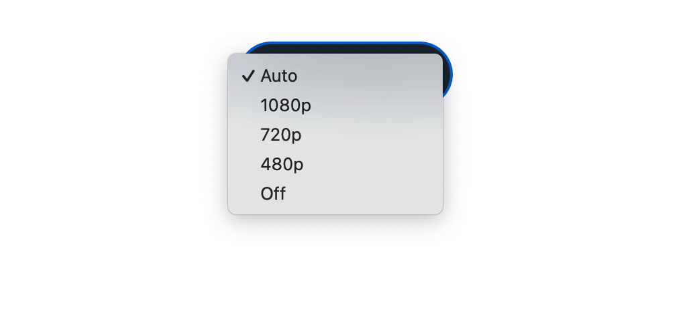
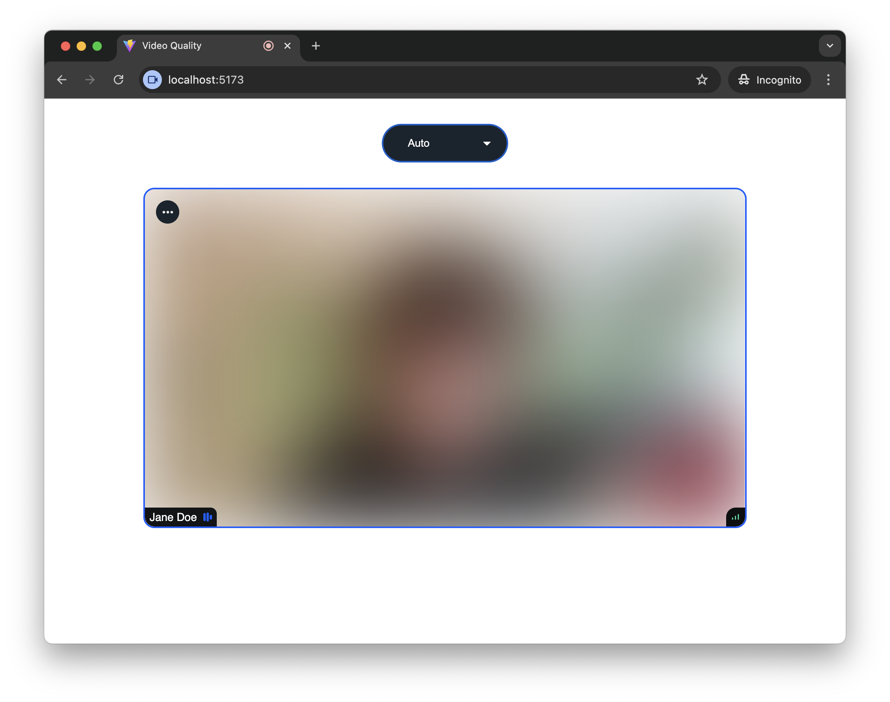

By default, our SDK chooses the incoming video quality that best matches the size of a video element for a given participant. It makes less sense to waste bandwidth receiving Full HD video when it's going to be displayed in a 320 by 240 pixel rectangle.

However, it's still possible to override this behavior and manually request higher resolution video for better quality, or lower resolution to save bandwidth. It's also possible to disable incoming video altogether for an audio-only experience.

:::note
Actual incoming video quality depends on a number of factors, such as the quality of the source video, and network conditions. Manual video quality selection allows you to specify your preference, while the actual resolution is automatically selected from the available resolutions to match that preference as closely as possible.
:::

In this article we'll build a UI control for manual video quality selection.

## Prerequisites

If you haven't already bootstrapped a video calling application (our [Video Calling Tutorial](https://getstream.io/video/sdk/react/tutorial/video-calling/) is a great place to start!), here's a very simple application that we'll use as a starting point:

```jsx
import {
  SpeakerLayout,
  StreamCall,
  StreamTheme,
  StreamVideo,
  StreamVideoClient,
} from '@stream-io/video-react-sdk';
import '@stream-io/video-react-sdk/dist/css/styles.css';

const client = new StreamVideoClient({
  apiKey: 'REPLACE_WITH_API_KEY',
  user: {
    id: 'REPALCE_WITH_USER_ID',
    name: 'Jane Doe',
  },
  token: 'REPLACE_WITH_TOKEN',
});

const App = () => {
  const [call, setCall] = useState(null);

  useEffect(() => {
    const newCall = client.call('appointment', callId);
    newCall
      .join({ create: true })
      .then(() => setCall(newCall))
      .catch(() => console.error('Failed to join the call'));

    return () =>
      newCall.leave().catch(() => console.error('Failed to leave the call'));
  }, []);

  if (!call) {
    return <>Loading...</>;
  }

  return (
    <StreamTheme>
      <StreamVideo client={client}>
        <StreamCall call={call}>
          <SpeakerLayout />
        </StreamCall>
      </StreamVideo>
    </StreamTheme>
  );
};
```

## Getting and Setting Incoming Video Settings

To get the current incoming video quality settings, we will use the `useIncomingVideoQualitySettings` call state hook. Most importantly, it returns the following two values:

- `enabled` - a boolean flag indicating whether incoming video is enabled.
- `preferredResolution` - if video is enabled, an object of the shape `{ width: number; height: number }` containing the current preferred resolution of the incoming video.

To modify the current setting, the following two methods are available on the Call object:

- `setIncomingVideoEnabled` - enables or disables incoming video, clearing any preferred resolution.
- `setPreferredIncomingVideoResolution` - sets the preference for the incoming video resolution, enabling video if it was previously disabled.

To combine these two settings into a single control, we'll need to do some mapping:

```typescript
import type { Call } from '@stream-io/video-react-sdk';

const incomingVideoSettings = ['auto', '1080p', '720p', '480p', 'off'] as const;
type IncomingVideoSetting = (typeof incomingVideoSettings)[number];
type VideoDimension = { width: number; height: number };

function applyIncomingVideoSetting(call: Call, setting: IncomingVideoSetting) {
  if (setting === 'auto') {
    call.setIncomingVideoEnabled(true);
  } else if (setting === 'off') {
    call.setIncomingVideoEnabled(false);
  } else {
    call.setPreferredIncomingVideoResolution(
      incomingVideoSettingToResolution(setting),
    );
  }
}

function incomingVideoSettingToResolution(
  setting: Exclude<IncomingVideoSetting, 'auto' | 'off'>,
): VideoDimension {
  switch (setting) {
    case '1080p':
      return { width: 1920, height: 1080 };
    case '720p':
      return { width: 1280, height: 720 };
    case '480p':
      return { width: 640, height: 480 };
  }
}

function incomingVideoResolutionToSetting(
  resolution: VideoDimension,
): IncomingVideoSetting {
  switch (true) {
    case resolution.height >= 1080:
      return '1080p';
    case resolution.height >= 720:
      return '720p';
    case resolution.height >= 480:
      return '480p';
    default:
      return 'auto';
  }
}
```

It's also possible to set a preferred resolution per call participant. There's an optional second parameter to the `setPreferredIncomingVideoResolution`, accepting an array of participant session ids:

```typescript
const { useParticipants } = useCallStateHooks();
const participants = useParticipants();
const [dominantParticipant] = participants;

call.setPreferredIncomingVideoResolution(
  incomingVideoSettingToResolution('1080p'),
  [dominantParticipant.sessionId],
);
```

However, in this cookbook we assume that the preferences apply to all call participants.

## Building Incoming Video Quality Selector

Now we're ready to build a UI control to display and change the incoming video quality.

```tsx
import type { FormEvent } from 'react';
import { useCallStateHooks } from '@stream-io/video-react-sdk';

const IncomingVideoQualitySelector = () => {
  const call = useCall();
  const { useIncomingVideoSettings } = useCallStateHooks();
  const { enabled, preferredResolution } = useIncomingVideoSettings();
  let currentSetting: IncomingVideoSetting;

  if (!preferredResolution) {
    currentSetting = enabled ? 'auto' : 'off';
  } else {
    currentSetting = incomingVideoResolutionToSetting(preferredResolution);
  }

  const handleChange = (event: FormEvent<HTMLSelectElement>) => {
    if (call) {
      const setting = event.currentTarget.value as IncomingVideoSetting;
      applyIncomingVideoSetting(call, setting);
    }
  };

  return (
    <div className="quality-selector">
      <select
        className="quality-selector-dropdown"
        value={currentSetting}
        onChange={handleChange}
      >
        {incomingVideoSettings.map((setting) => (
          <option key={setting} value={setting}>
            {setting}
          </option>
        ))}
      </select>
    </div>
  );
};
```



And now by adding this component inside of the `StreamCall`, we have a video quality selector in the call UI:

```jsx
<StreamVideo client={client}>
  <StreamCall call={call}>
    <IncomingVideoQualitySelector />
    <SpeakerLayout />
  </StreamCall>
</StreamVideo>
```


