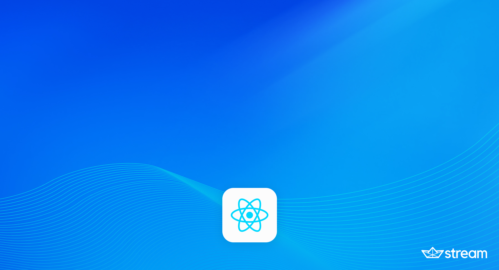

# Stream Video React Native UI Cookbook

#### Start exploring the Stream Video React Native UI Cookbook in few simple steps

### Installation ans Setup:
- Create an `.env` file in the root of the project, check out the `.env-example` file for the required variables
- Install the dependencies: `yarn` or `npm install`
- Install pods by running `npx pod-install`

### Running the app
- Via Yarn: `yarn ios` or `yarn android`
- Via NPM: `npm run ios` or `npm run android`

### Creating new recipes
- Create a new folder in `src/recipes` with the name of the recipe
- Add a recipe screen in `src/recipes/<recipe-name>/<RecipeName>.tsx`
- Add your recipe definition to the recipes definition array in `src/recipes/recipes.ts`

